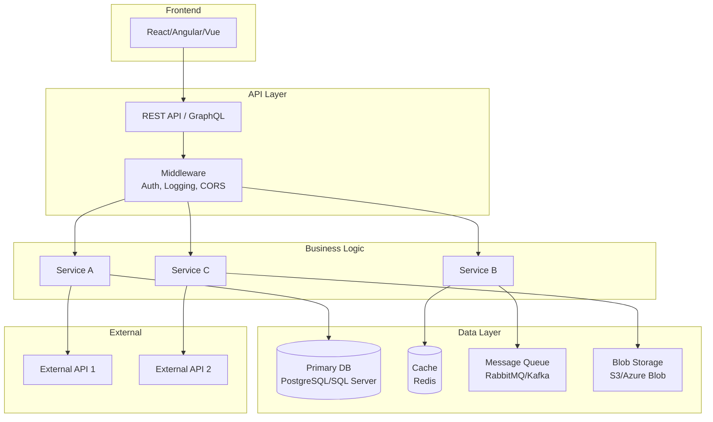

# 🏗️ 2. High-Level Discovery (Day 1)

> Understand the big picture: what the project does, how it's structured, and what technologies it uses.

---

## 🎯 Day 1 Goals

- [ ] Understand the project's purpose and business context
- [ ] Map the repository structure
- [ ] Identify the tech stack and key dependencies
- [ ] Draw a high-level architecture diagram
- [ ] Build and run the project locally
- [ ] Identify key configuration files

---

## Step 1: Project Purpose & Context

### Prompt to use in Copilot Chat:

```
@workspace Give me a comprehensive overview of this project:

1. **Purpose**: What problem does this project solve? Who are the users?
2. **Tech Stack**: Languages, frameworks, databases, message queues, cloud services
3. **Repo Structure**: Explain the top-level directory layout and what each folder contains
4. **Key Entry Points**: Where does the application start? (main files, startup classes, etc.)
5. **External Dependencies**: What external services or APIs does this project depend on?

Format the response with clear headings and include a Mermaid architecture diagram.
```

### What to look for manually:

```
📁 Check these files first:
├── README.md                  → Project overview, setup instructions
├── CONTRIBUTING.md            → Development workflow
├── docs/                      → Architecture docs, ADRs
├── package.json / *.csproj    → Dependencies & scripts
├── docker-compose.yml         → Service dependencies
├── Makefile / Taskfile        → Build/run commands
├── .env.example               → Environment variables needed
└── ci/cd pipeline files       → Build & deploy process
    ├── .github/workflows/
    ├── azure-pipelines.yml
    └── Jenkinsfile
```

---

## Step 2: Repository Structure Map

### Prompt:

```
@workspace Create a detailed directory tree of this project showing only the important
folders and files (skip node_modules, bin, obj, .git, etc.). For each major folder,
add a one-line comment explaining its purpose. Format as a tree diagram.
```

### Expected Output Template:

```
📦 project-root
├── 📂 src/                    # Main application source code
│   ├── 📂 api/                # REST/GraphQL API layer
│   ├── 📂 services/           # Business logic layer
│   ├── 📂 models/             # Data models / entities
│   ├── 📂 repositories/       # Data access layer
│   ├── 📂 middleware/         # Request pipeline middleware
│   ├── 📂 config/             # Configuration management
│   └── 📂 utils/              # Shared utilities
├── 📂 tests/                  # Test suites
├── 📂 docs/                   # Documentation
├── 📂 scripts/                # Build/deploy/utility scripts
├── 📂 infra/                  # Infrastructure as Code
└── 📂 .github/                # CI/CD workflows
```

---

## Step 3: Tech Stack & Dependency Map

### Prompt:

```
@workspace Analyze all dependency/package files in this project (package.json,
requirements.txt, *.csproj, go.mod, pom.xml, etc.) and create a categorized
summary of dependencies:

1. **Frameworks**: (e.g., Express, ASP.NET, Spring Boot)
2. **Databases**: (e.g., PostgreSQL driver, MongoDB driver, Redis)
3. **Authentication**: (e.g., JWT, OAuth libraries)
4. **Testing**: (e.g., Jest, xUnit, pytest)
5. **Observability**: (e.g., logging, metrics, tracing libraries)
6. **Cloud/Infra**: (e.g., AWS SDK, Azure SDK, Terraform)
7. **Other Notable**: anything else important

Include version numbers where relevant.
```

### Mermaid Template — Tech Stack:



---

## Step 4: Architecture Diagram

### Prompt:

```
@workspace Create a Mermaid architecture diagram showing:
1. All services/components in this project
2. How they communicate (HTTP, gRPC, message queue, etc.)
3. External dependencies (databases, caches, third-party APIs)
4. The flow of a typical user request from entry point to response

Use a top-down layout with clear labels on all arrows.
```

---

## Step 5: Build & Run Locally

### Prompt:

```
@workspace What are the exact steps to build and run this project locally?
Include:
1. Prerequisites (runtime versions, tools needed)
2. Environment variables to set (check .env.example or appsettings)
3. Database setup steps
4. Build commands
5. Run commands
6. How to verify it's working (health check URL, test command, etc.)
```

### Pro Tips:
- If `docker-compose.yml` exists, try `docker-compose up` first — it often "just works"
- Check the CI pipeline YAML — it shows the exact build steps that are known to work
- Look at `Makefile` or `package.json` scripts for common commands

---

## Step 6: Configuration & Environment

### Prompt:

```
@workspace List all configuration files in this project and explain:
1. What each config file controls
2. Key environment variables and their purpose
3. Different environments (dev, staging, prod) and how they're configured
4. Any secrets or sensitive config (what's needed, not the actual values)
```

---

## 📊 Day 1 Output Checklist

By end of Day 1, you should have:

| Artifact | Status |
|----------|--------|
| Project purpose written in your own words | ⬜ |
| Repo structure map (annotated tree) | ⬜ |
| Tech stack summary (categorized) | ⬜ |
| High-level architecture Mermaid diagram | ⬜ |
| Project running locally | ⬜ |
| List of config files & env vars understood | ⬜ |

---

*Next → [3-MODULE-DEEP-DIVE.md](3-MODULE-DEEP-DIVE.md)*
