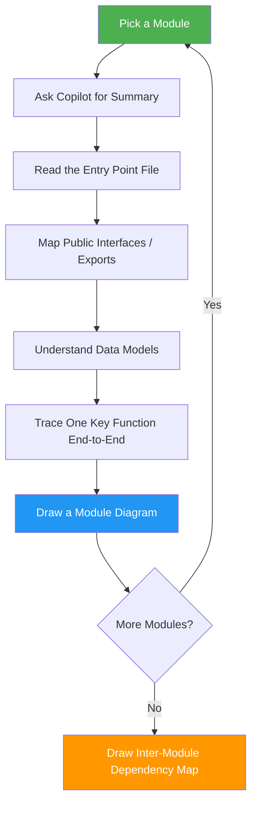
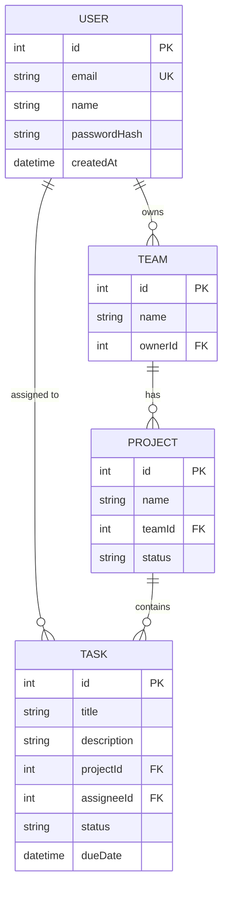
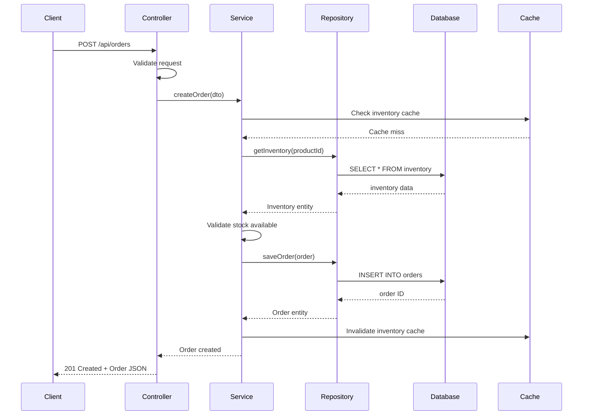
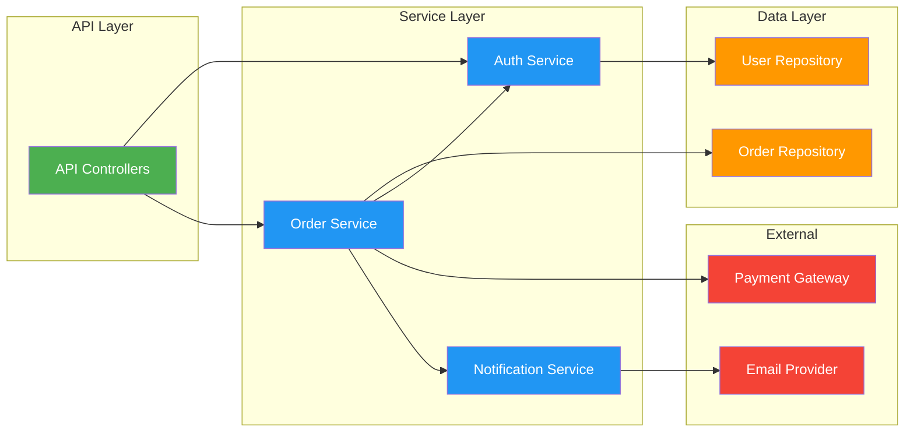

# 🔬 3. Module Deep-Dive (Day 2 — Morning)

> Go module by module. Understand each component's responsibility, interfaces, and internal logic.

---

## 🎯 Goals

- [ ] Understand each module/service's single responsibility
- [ ] Map the public API surface of each module
- [ ] Understand data models and database schema
- [ ] Identify design patterns used (Repository, CQRS, MVC, etc.)
- [ ] Document inter-module dependencies

---

## Strategy: The Module Analysis Loop

For **each** major module/folder, run through this loop:



---

## Step 1: Module Summary

### Prompt (repeat for each module):

```
@workspace Analyze the [MODULE_NAME] module/folder at [PATH]:

1. **Purpose**: What does this module do? What business problem does it solve?
2. **Key Files**: List the most important files and their roles
3. **Public API**: What functions/classes/endpoints does it expose?
4. **Dependencies**: What other modules does it depend on? What depends on it?
5. **Data Models**: What are the key data structures/entities?
6. **Design Patterns**: What patterns are used (Repository, Factory, Strategy, etc.)?
7. **Error Handling**: How does it handle errors and edge cases?

Include a Mermaid class diagram or component diagram.
```

---

## Step 2: Interface & Contract Analysis

### Prompt:

```
@workspace For the [MODULE_NAME] module, list all:

1. **API Endpoints** (if it's a web module): HTTP method, path, request/response schema
2. **Public Methods/Functions**: signature, parameters, return types
3. **Events Published/Consumed**: event names and payload shapes
4. **Configuration Options**: what settings control this module's behavior

Format as a table for each category.
```

### Expected Output — API Surface Table:

| Method | Endpoint | Auth | Request Body | Response | Description |
|--------|----------|------|-------------|----------|-------------|
| GET | /api/users | JWT | — | User[] | List all users |
| POST | /api/users | JWT | CreateUserDto | User | Create a user |
| GET | /api/users/:id | JWT | — | User | Get user by ID |

---

## Step 3: Data Model & Schema Analysis

### Prompt:

```
@workspace Analyze all data models/entities in this project:

1. List every model/entity class with its fields and types
2. Show relationships between models (1:1, 1:N, N:N)
3. Create a Mermaid ER diagram showing the database schema
4. Identify any migrations or schema versioning approach
```

### Mermaid Template — ER Diagram:



---

## Step 4: Single Function Deep Trace

Pick the **most important function** in each module and trace it end-to-end.

### Prompt:

```
@workspace Trace the complete execution flow of [FUNCTION_NAME] in [FILE_PATH]:

1. Who calls this function? (callers / entry points)
2. Step-by-step what it does internally
3. What other functions/services does it call?
4. What data does it read/write?
5. What errors can occur and how are they handled?
6. What is returned to the caller?

Create a Mermaid sequence diagram showing the complete flow.
```

### Mermaid Template — Sequence Diagram:



---

## Step 5: Design Patterns Identification

### Prompt:

```
@workspace What design patterns are used in this codebase? For each pattern found:

1. Name of the pattern
2. Where it's implemented (file paths)
3. Why it's used (what problem it solves here)
4. A brief code example from this repo

Common patterns to look for: Repository, Unit of Work, CQRS, Mediator,
Factory, Strategy, Observer/Event-Driven, Dependency Injection, Middleware Pipeline,
Circuit Breaker, Retry, Decorator.
```

---

## Step 6: Inter-Module Dependency Map

After analyzing all modules, create the big picture:

### Prompt:

```
@workspace Create a Mermaid dependency graph showing how all modules/services
in this project depend on each other. Use arrows to show the direction of
dependency (A → B means A depends on B). Color-code by layer:
- Green: API/Controller layer
- Blue: Service/Business logic layer
- Orange: Data access layer
- Red: External integrations
```

### Mermaid Template — Module Dependencies:



---

## 📊 Day 2 Morning Checklist

| Artifact | Status |
|----------|--------|
| Each module summarized (purpose + key files) | ⬜ |
| API surface documented (endpoints/methods) | ⬜ |
| ER diagram of database schema | ⬜ |
| At least 2 functions traced end-to-end | ⬜ |
| Design patterns identified | ⬜ |
| Inter-module dependency diagram | ⬜ |

---

*Next → [4-FLOW-TRACING.md](4-FLOW-TRACING.md)*
