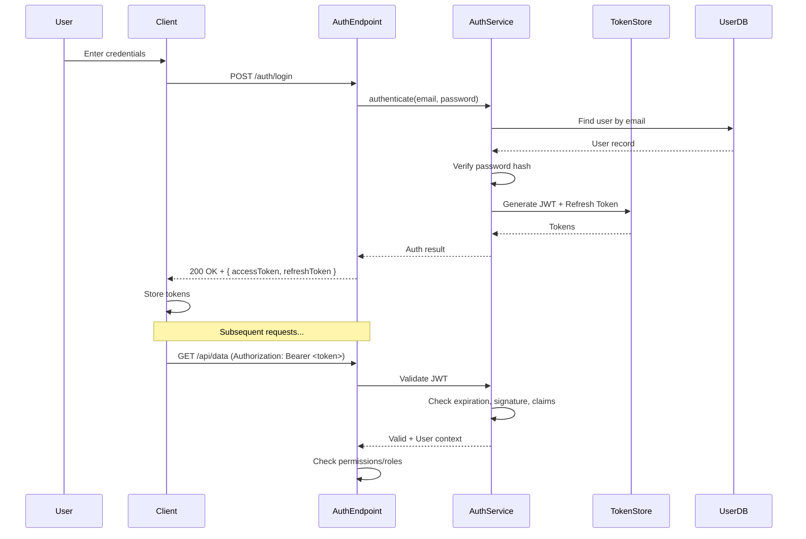
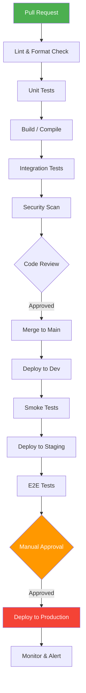
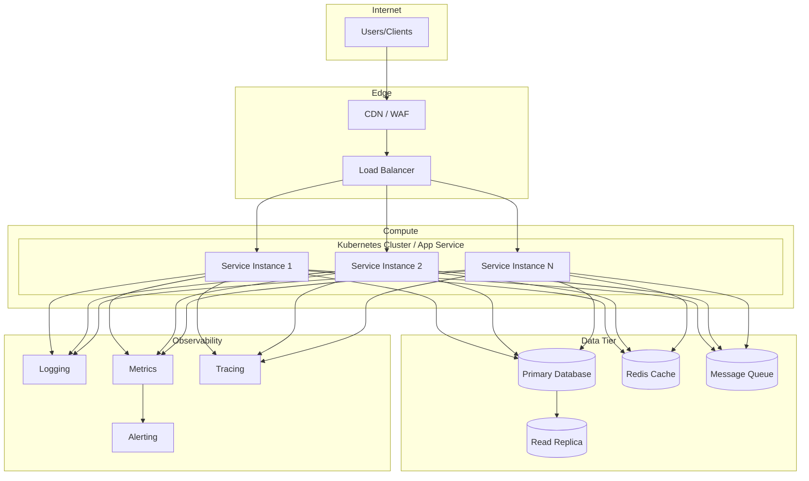

# 🔄 4. End-to-End Flow Tracing (Day 2 Afternoon – Day 3)

> Connect the dots. Trace real user scenarios through the entire system.

---

## 🎯 Goals

- [ ] Trace 3–5 critical user journeys end-to-end
- [ ] Understand the request/response pipeline
- [ ] Map error handling and retry flows
- [ ] Understand the CI/CD pipeline
- [ ] Document deployment architecture

---

## Strategy: Pick the Top Flows

### Prompt to identify key flows:

```
@workspace What are the 5 most important user-facing workflows in this application?
For each workflow, tell me:
1. What the user does (e.g., "User logs in")
2. What API endpoints are called
3. What services are involved
4. What data is read/written
```

---

## Step 1: Trace a Critical Flow

### The Master Flow-Tracing Prompt:

```
@workspace Trace the complete end-to-end flow for: [DESCRIBE THE USER ACTION]

Cover every layer from the UI/API call to the database and back:

1. **Entry Point**: Which file/function receives the initial request?
2. **Authentication/Authorization**: How is the request authenticated? What permissions are checked?
3. **Validation**: Where and how is input validated?
4. **Business Logic**: What service methods are called? What rules are applied?
5. **Data Access**: What database queries run? What tables are touched?
6. **Side Effects**: Are events published? Emails sent? Caches updated? Logs written?
7. **Response**: How is the response built and returned?
8. **Error Paths**: What happens if each step fails?

Create a detailed Mermaid sequence diagram AND a flowchart for the happy path and error paths.
```

---

## Step 2: Request Pipeline / Middleware Analysis

### Prompt:

```
@workspace Explain the complete request processing pipeline:

1. What happens before a request reaches the controller/handler?
   (middleware, filters, interceptors)
2. In what order do middleware components execute?
3. What cross-cutting concerns are handled? (auth, logging, CORS, rate limiting,
   error handling, request/response transformation)
4. How does the pipeline differ for different routes or environments?

Create a Mermaid flowchart showing the pipeline stages.
```

### Mermaid Template — Request Pipeline:


---

## Step 3: Error Handling & Resilience

### Prompt:

```
@workspace How does this project handle errors and failures?

1. **Global Error Handling**: Is there a global exception handler? Where?
2. **Error Response Format**: What does an error response look like? (status codes, error body)
3. **Retry Logic**: Are there retries for external calls? What retry strategy?
4. **Circuit Breakers**: Are circuit breakers used for external dependencies?
5. **Logging**: How are errors logged? What logging framework is used?
6. **Alerting**: Are there health checks or monitoring hooks?

Show me examples of error handling patterns from the code.
```

---

## Step 4: Authentication & Authorization Flow

### Prompt:

```
@workspace Trace the complete authentication and authorization flow:

1. How does a user authenticate? (JWT, OAuth, API Key, Session, etc.)
2. Where are credentials validated?
3. How are tokens generated, refreshed, and invalidated?
4. How is authorization checked? (roles, permissions, policies, claims)
5. What happens when auth fails? (401 vs 403 handling)
6. Are there different auth schemes for different endpoints?

Create a Mermaid sequence diagram for the login flow and a separate one for
how an authenticated request is processed.
```

### Mermaid Template — Auth Flow:



---

## Step 5: CI/CD & Deployment Pipeline

### Prompt:

```
@workspace Analyze the CI/CD pipeline configuration files and explain:

1. **Build Pipeline**: What steps run on every PR / commit?
   (lint, test, build, scan, etc.)
2. **Test Strategy**: What types of tests run? (unit, integration, e2e)
   How is coverage tracked?
3. **Deployment Pipeline**: How does code get deployed?
   (environments, approval gates, rollback strategy)
4. **Infrastructure**: Is there IaC? (Terraform, ARM templates, Bicep, Helm)
5. **Environments**: What environments exist? (dev, staging, canary, prod)

Create a Mermaid flowchart of the CI/CD pipeline.
```

### Mermaid Template — CI/CD Pipeline:



---

## Step 6: Deployment Architecture

### Prompt:

```
@workspace Describe the deployment architecture:

1. Where does this application run? (Kubernetes, App Service, VMs, Lambda, etc.)
2. How is it scaled? (horizontal/vertical, auto-scaling rules)
3. What are the networking components? (load balancer, API gateway, CDN, VNet)
4. How are secrets managed? (Key Vault, Secret Manager, env vars)
5. What monitoring/observability tools are in place? (App Insights, Datadog, Prometheus)
6. Disaster recovery: How is the system backed up? What's the failover strategy?

Create a Mermaid deployment diagram.
```

### Mermaid Template — Deployment Architecture:



---

## 📊 Day 2–3 Checklist

| Artifact | Status |
|----------|--------|
| 3+ critical flows traced with sequence diagrams | ⬜ |
| Request pipeline documented | ⬜ |
| Error handling strategy understood | ⬜ |
| Auth flow mapped | ⬜ |
| CI/CD pipeline documented | ⬜ |
| Deployment architecture diagrammed | ⬜ |

---

*Next → [5-REUSABLE-PROMPTS.md](5-REUSABLE-PROMPTS.md)*
