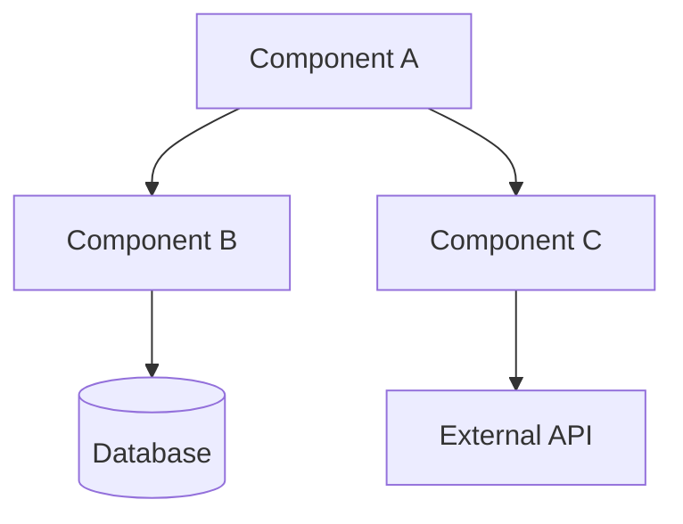
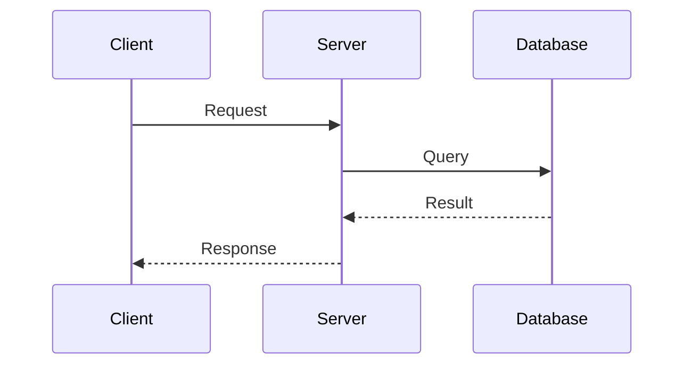
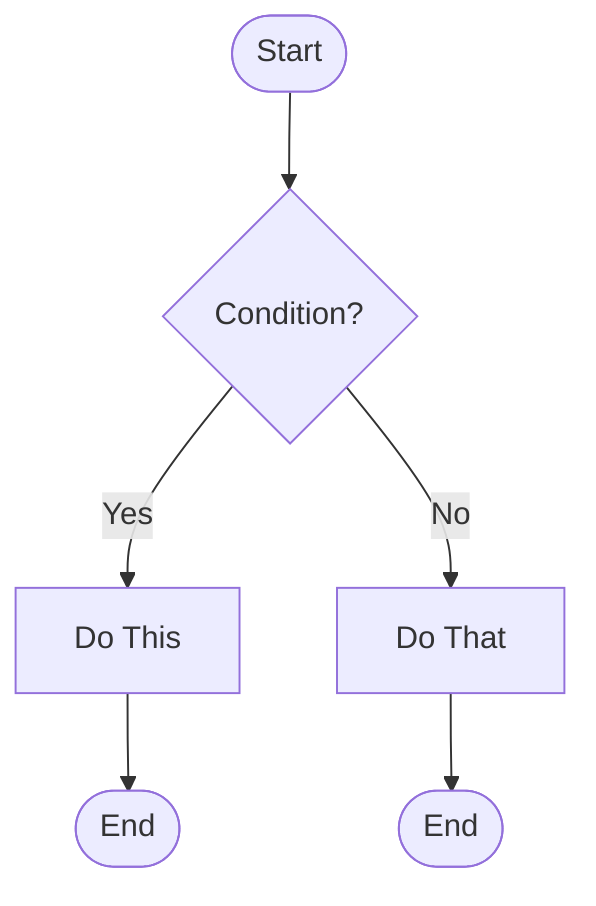
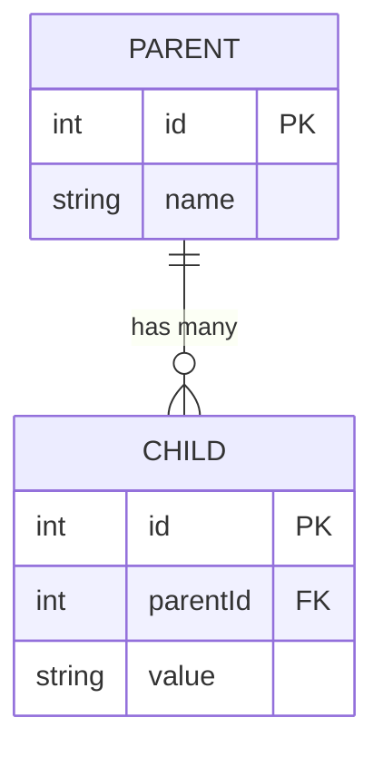
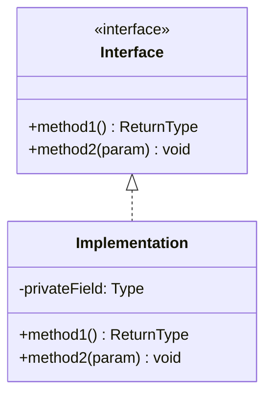
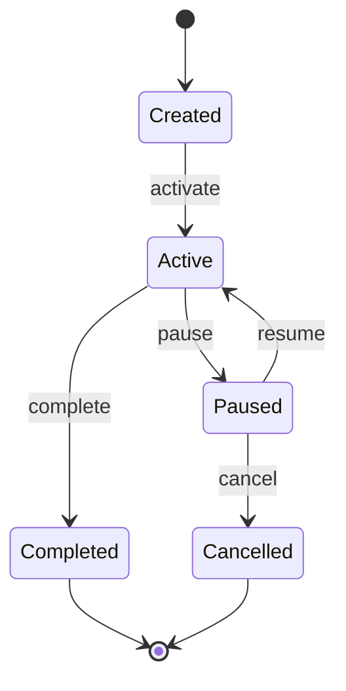
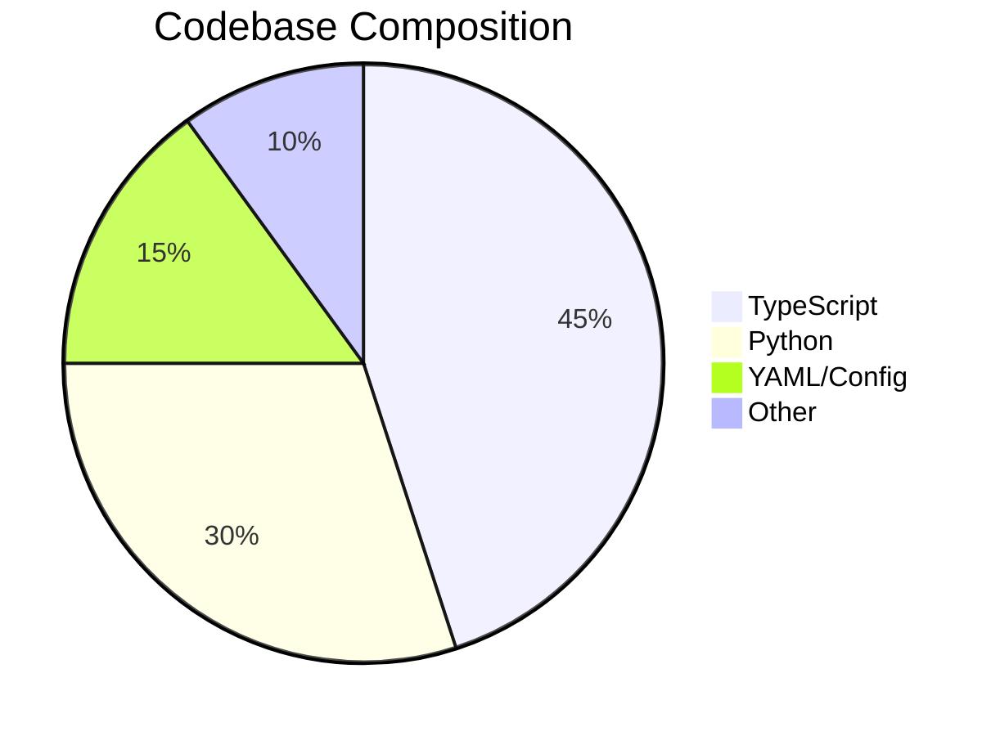
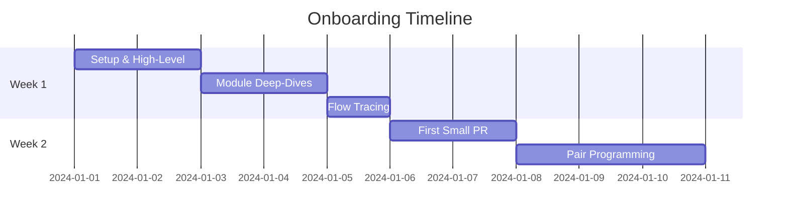

# 📐 6. Output Templates & Diagram Reference

> Ready-to-fill templates for documenting your understanding. Copy, fill in, and save.

---

## Template 1: Project Summary Card

```markdown
# [PROJECT NAME] — Summary Card

| Field | Value |
|-------|-------|
| **Purpose** | [What does it do in 1 sentence] |
| **Users** | [Who uses it] |
| **Tech Stack** | [Languages, Frameworks, DBs] |
| **Repo** | [URL] |
| **Main Branch** | [main/master/develop] |
| **Build Command** | [npm run build / dotnet build / etc.] |
| **Run Command** | [npm start / dotnet run / etc.] |
| **Test Command** | [npm test / dotnet test / etc.] |
| **CI/CD** | [GitHub Actions / Azure Pipelines / etc.] |
| **Deployed To** | [AKS / App Service / AWS / etc.] |
| **Docs** | [Link to docs folder or wiki] |
| **Team Channel** | [Teams/Slack channel] |
```

---

## Template 2: Module Documentation

```markdown
# Module: [MODULE_NAME]

## Purpose
[1-2 sentences explaining what this module does]

## Key Files
| File | Purpose |
|------|---------|
| `[file1]` | [description] |
| `[file2]` | [description] |

## Public API
| Method/Endpoint | Parameters | Returns | Description |
|-----------------|-----------|---------|-------------|
| [name] | [params] | [return type] | [what it does] |

## Dependencies
- **Depends on**: [list of modules this depends on]
- **Depended by**: [list of modules that depend on this]

## Data Models
[Mermaid ER diagram or class diagram]

## Key Flows
[Mermaid sequence diagram of the main flow]

## Notes
- [Any gotchas, tech debt, or important context]
```

---

## Template 3: Flow Documentation

```markdown
# Flow: [FLOW_NAME] (e.g., "User Registration")

## Trigger
[What initiates this flow — API call, event, scheduled job]

## Happy Path
[Mermaid sequence diagram]

## Error Scenarios
| Error | Cause | Handling | User Impact |
|-------|-------|----------|-------------|
| [error] | [cause] | [how handled] | [what user sees] |

## Data Changes
| Table/Entity | Operation | Fields Affected |
|-------------|-----------|-----------------|
| [table] | INSERT/UPDATE/DELETE | [fields] |

## Side Effects
- [ ] Email sent
- [ ] Event published
- [ ] Cache updated
- [ ] Log entry written
- [ ] External API called
```

---

## Mermaid Diagram Quick Reference

### Architecture Diagram (Top-Down)


### Sequence Diagram


### Flowchart (Decision Logic)


### Entity Relationship


### Class Diagram


### State Machine


### Pie Chart (for tech stack breakdown, etc.)


### Gantt Chart (for onboarding timeline)


---

## Mermaid Syntax Cheat Sheet

| Element | Syntax | Notes |
|---------|--------|-------|
| Rectangle | `A[Text]` | Standard node |
| Rounded | `A(Text)` | Soft edges |
| Stadium | `A([Text])` | Start/End |
| Diamond | `A{Text}` | Decision |
| Database | `A[(Text)]` | Cylinder |
| Arrow | `A --> B` | Solid line |
| Dotted Arrow | `A -.-> B` | Dashed line |
| Arrow + Label | `A -->|label| B` | Labeled edge |
| Subgraph | `subgraph Title ... end` | Grouping |
| Color | `style A fill:#color` | Node styling |
| Note | `Note over A,B: text` | Sequence diagram notes |

---

## 🎓 Putting It All Together

After completing the onboarding, create one master document:

```markdown
# [Project Name] — Onboarding Summary

## 1. Architecture Overview
[Architecture diagram + 2-3 paragraph summary]

## 2. Tech Stack
[Categorized dependency list]

## 3. Module Map
[Table of all modules with 1-line descriptions]

## 4. Key Flows
[Top 3 flows with sequence diagrams]

## 5. Data Model
[ER diagram]

## 6. Getting Started
[Build/run/test commands]

## 7. Important Files
[Top 10 files every developer should know]

## 8. Glossary
[Domain-specific terms and their meanings]
```

---

## 🤝 Share with Your Team

Save your filled-in templates to the project's `docs/onboarding/` folder so the next person can:
1. Read your summaries first (saves them hours)
2. Use the same prompts to go deeper
3. Update the docs as the project evolves

---

*🎉 You've completed the onboarding kit! Happy coding!*
