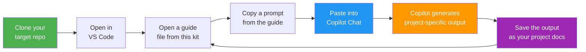

# 🚀 AI-Powered Codebase Onboarding Kit

[](https://opensource.org/licenses/MIT)
[](CONTRIBUTING.md)
[](https://github.com/features/copilot)

> **Ramp up on any new codebase in 2–3 days** using GitHub Copilot, VS Code, and structured exploration.

Joining a new project? Tired of spending weeks reading code before you feel productive? This kit gives you a **repeatable, prompt-driven playbook** to understand any codebase — from 10,000-foot architecture down to individual functions — using AI as your copilot.

**Works with any language. Any framework. Any repo size.**

---

## 🎥 Demo

> _Watch the full walkthrough:_ [Coming Soon](#)

---

## 📋 Table of Contents

| Document | Purpose | Time |
|----------|---------|------|
| [1-SETUP.md](1-SETUP.md) | Tool setup & prerequisites | 30 min |
| [2-HIGH-LEVEL-DISCOVERY.md](2-HIGH-LEVEL-DISCOVERY.md) | Architecture, tech stack, repo structure | Day 1 |
| [3-MODULE-DEEP-DIVE.md](3-MODULE-DEEP-DIVE.md) | Per-module / per-service analysis | Day 2 |
| [4-FLOW-TRACING.md](4-FLOW-TRACING.md) | End-to-end request & data flows | Day 2–3 |
| [5-REUSABLE-PROMPTS.md](5-REUSABLE-PROMPTS.md) | Copy-paste prompts for any project | Ongoing |
| [6-OUTPUT-TEMPLATES.md](6-OUTPUT-TEMPLATES.md) | Mermaid diagram & doc templates | Reference |
| [examples/](examples/) | Real-world example output (Login Kit Sample) | Reference |

---

## 🗺️ The 3-Day Onboarding Roadmap

```mermaid
gantt
    title 3-Day Codebase Onboarding Plan
    dateFormat  X
    axisFormat %s

    section Day 1 – Discover
    Tool Setup & Repo Clone          :d1a, 0, 2
    High-Level Architecture Scan     :d1b, 2, 5
    Tech Stack & Dependency Map      :d1c, 5, 7
    Build & Run Locally              :d1d, 7, 10

    section Day 2 – Dive Deep
    Module-by-Module Analysis        :d2a, 10, 14
    Database & Data Model Review     :d2b, 14, 16
    API Surface Mapping              :d2c, 16, 18

    section Day 3 – Connect
    End-to-End Flow Tracing          :d3a, 18, 22
    CI/CD & Deployment Review        :d3b, 22, 24
    Write Your Own Summary Doc       :d3c, 24, 26
```



---

## 🧠 Core Philosophy

1. **Top-Down, then Bottom-Up** — Start with architecture, then zoom into modules.
2. **Let AI Read First, You Verify** — Use Copilot to generate summaries, then validate by reading key files.
3. **Diagram Everything** — A picture is worth 1,000 lines of code. Use Mermaid charts liberally.
4. **Ask "Why", not just "What"** — Understanding *design decisions* matters more than memorizing code.
5. **Learn by Modifying** — After Day 2, make a small change (fix a typo, add a log) to solidify understanding.

---

## 📖 How to Use This Kit

This kit is a **prompt-driven playbook** — it does NOT contain pre-generated docs about your project. Instead, each file gives you **ready-to-paste prompts** that you run inside GitHub Copilot Chat against your actual codebase. Copilot then generates the real architecture docs, diagrams, and analysis for you.

### Step-by-Step Workflow



### 1️⃣ Setup (~30 min)
- Open [1-SETUP.md](1-SETUP.md)
- Install VS Code, GitHub Copilot extension, and recommended extensions
- Clone your target repo and verify Copilot Chat is working (`Ctrl+Shift+I`)

### 2️⃣ Day 1 — High-Level Discovery
- Open [2-HIGH-LEVEL-DISCOVERY.md](2-HIGH-LEVEL-DISCOVERY.md) **side-by-side** with Copilot Chat
- Copy each prompt (they start with `@workspace ...`) into Copilot Chat
- Replace any `[PLACEHOLDERS]` with your project's actual names/paths
- Copilot will generate architecture diagrams, tech stack summaries, and repo maps
- **Save the output** — this becomes your project's onboarding doc

### 3️⃣ Day 2 — Module Deep-Dive
- Open [3-MODULE-DEEP-DIVE.md](3-MODULE-DEEP-DIVE.md)
- For **each major folder/module** in your project, repeat the "module analysis loop"
- Use the prompts to generate class diagrams, ER diagrams, and dependency maps
- Tip: Use `#file:path/to/file` in prompts to give Copilot specific file context

### 4️⃣ Day 2–3 — Flow Tracing
- Open [4-FLOW-TRACING.md](4-FLOW-TRACING.md)
- Pick 3–5 critical user journeys (e.g., login, create order, deploy)
- Use the flow-tracing prompts to generate sequence diagrams for each
- Document the CI/CD pipeline and deployment architecture

### 5️⃣ Ongoing — Prompt Cheat Sheet
- **[5-REUSABLE-PROMPTS.md](5-REUSABLE-PROMPTS.md)** is the file you'll use most often
- It has **20+ categorized, copy-paste prompts** that work on any codebase
- Keep it open anytime you need to explore something new

### 6️⃣ Reference — Templates & Diagrams
- Use [6-OUTPUT-TEMPLATES.md](6-OUTPUT-TEMPLATES.md) to structure your final documentation
- Includes fill-in-the-blank templates and a Mermaid syntax cheat sheet

### 💡 Key Concept

| This kit provides | You + Copilot generate |
|---|---|
| Generic prompts & templates | Project-specific architecture docs |
| Mermaid diagram skeletons | Filled-in diagrams for YOUR codebase |
| A structured 3-day process | Real understanding of the project |

> **Think of it like a cookbook 🍳** — the kit gives you recipes, Copilot does the cooking for your specific repo.

---

## ⚡ Quick Start (< 5 minutes)

If you only have 5 minutes, open **GitHub Copilot Chat** in VS Code at the repo root and paste:

```
@workspace Explain this project at a high level. What does it do, what tech stack does
it use, how is the repo structured, and what are the main components/services?
Include a Mermaid architecture diagram.
```

That single prompt gives you a solid mental model to start from.

---

## 👥 For Team Leads

To onboard your entire team:

1. Clone this kit into your project repo under `docs/onboarding/`
2. Have one person run through it first and fill in project-specific details
3. Share the filled-in docs + Mermaid diagrams with the rest of the team
4. Use the prompts in [5-REUSABLE-PROMPTS.md](5-REUSABLE-PROMPTS.md) during team walkthroughs

---

*Created with ❤️ for fast onboarding. Works with any language, any framework, any repo size.*

---

## 🛠️ Installation

### Option A: Clone the kit (recommended)
```bash
git clone https://github.com/sreesundeep/copilot-onboarding-kit.git
```

### Option B: Add to your project
Copy the kit into your project's docs folder so your entire team benefits:
```bash
# From your project root
git clone https://github.com/sreesundeep/copilot-onboarding-kit.git docs/onboarding
rm -rf docs/onboarding/.git
git add docs/onboarding && git commit -m "Add onboarding kit"
```

### Option C: Download ZIP
[Download the latest release](https://github.com/sreesundeep/copilot-onboarding-kit/archive/refs/heads/main.zip) and extract it.

---

## 🌟 Star This Repo

If this kit helped you onboard faster, give it a ⭐ — it helps others discover it!

---

## 🤝 Contributing

Contributions are welcome! Whether it's a new prompt, a better diagram, or a typo fix — see [CONTRIBUTING.md](CONTRIBUTING.md) for guidelines.

---

## 📜 License

This project is licensed under the [MIT License](LICENSE) — use it freely, share it widely.

---

## 🙏 Acknowledgments

- [GitHub Copilot](https://github.com/features/copilot) — the AI that powers the prompts
- [Mermaid](https://mermaid.js.org/) — for beautiful diagrams as code
- Every developer who's ever felt lost joining a new project — this is for you
