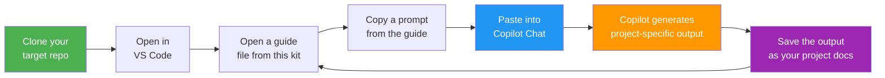

# 🚀 AI-Powered Codebase Onboarding Kit

[](https://opensource.org/licenses/MIT)
[](CONTRIBUTING.md)
[](https://github.com/features/copilot)
[](https://github.com/sreesundeep/copilot-onboarding-kit/stargazers)
[](https://github.com/sreesundeep/copilot-onboarding-kit/network/members)

> **Ramp up on any new codebase in 2–3 days** using GitHub Copilot, VS Code, and structured exploration.

Joining a new project? Tired of spending weeks reading code before you feel productive? This kit gives you a **repeatable, prompt-driven playbook** to understand any codebase — from 10,000-foot architecture down to individual functions — using AI as your copilot.

### ✅ Works with any language · ✅ Any framework · ✅ Any repo size · ✅ Any team size

---

## 🎯 Who Is This For?

**Built for software developers by default.** Also useful for other roles:

| Audience | How You'll Use It |
|----------|------------------|
| **🧑‍💻 Software Developers (default)** | **Follow the 3-day playbook to understand architecture, modules, and flows** |
| 🎓 Students & bootcamp grads | Learn how production codebases are structured by exploring real repos |
| 👔 Engineering Managers | Share with your team for consistent, fast onboarding across projects |
| 📋 Product Managers & Designers | Use the non-technical prompts to understand system capabilities |
| 🌍 Open-source contributors | Quickly understand any OSS repo before your first PR |

---

## 🎥 Demo

> **See the kit in action:** We onboard onto a Snapchat Login Kit sample repo in minutes using GitHub Copilot + this playbook.

📥 [▶ Download & Watch Demo Video](https://github.com/sreesundeep/copilot-onboarding-kit/raw/main/assets/demo.mp4)

---

## 📋 Table of Contents

| Document | Purpose | Time |
|----------|---------|------|
| [1-SETUP.md](1-SETUP.md) | Tool setup & prerequisites | 30 min |
| [2-HIGH-LEVEL-DISCOVERY.md](2-HIGH-LEVEL-DISCOVERY.md) | Architecture, tech stack, repo structure | Day 1 |
| [3-MODULE-DEEP-DIVE.md](3-MODULE-DEEP-DIVE.md) | Per-module / per-service analysis | Day 2 |
| [4-FLOW-TRACING.md](4-FLOW-TRACING.md) | End-to-end request & data flows | Day 2–3 |
| [5-REUSABLE-PROMPTS.md](5-REUSABLE-PROMPTS.md) | Copy-paste prompts for any project | Ongoing |
| [6-OUTPUT-TEMPLATES.md](6-OUTPUT-TEMPLATES.md) | Mermaid diagram & doc templates | Reference |
| [examples/](examples/) | Real-world example output (Login Kit Sample) | Reference |

---

## 🗺️ The 3-Day Onboarding Roadmap

```mermaid
gantt
    title 3-Day Codebase Onboarding Plan
    dateFormat  X
    axisFormat %s

    section Day 1 – Discover
    Tool Setup & Repo Clone          :d1a, 0, 2
    High-Level Architecture Scan     :d1b, 2, 5
    Tech Stack & Dependency Map      :d1c, 5, 7
    Build & Run Locally              :d1d, 7, 10

    section Day 2 – Dive Deep
    Module-by-Module Analysis        :d2a, 10, 14
    Database & Data Model Review     :d2b, 14, 16
    API Surface Mapping              :d2c, 16, 18

    section Day 3 – Connect
    End-to-End Flow Tracing          :d3a, 18, 22
    CI/CD & Deployment Review        :d3b, 22, 24
    Write Your Own Summary Doc       :d3c, 24, 26
```

[](https://mermaid.live/edit#pako:eNp1UsFuwjAM_ZXIJ5DYD-TABB0Sh8G0y5RDSN3WIk1K4jCE-PelLQxtp_jZfu_ZTi7MeEUs4tLi0dNOo6JkKyH5-bYPLgjFr68rUTiJI2fvRqCc0iJxIaqq4Z79YIPVQiinPQfJ4NcIb9JkJE5WW_OEwfOe-19qlVNROxRjG-LopJYY3rEYFPfxj5JIB8GGGE7p1TxFyNBGi-EHZ6D5oO2OvAz9Xsp9x11DLSrKWHEbP1Td87RxzJCH8IM9HnuKPV76AcMXB-3aDkp15u2IvCxjp0nkp5J_cfJXoD_9JX_8o3IqhCOtPCfuHAXeFfQRj0GC_Q55r5W0Wn5jNk2zTpxnEbGaqIxFwj2mI6vJqoUXvMaKeYqn3LKowyLMGiwpt4DpKQ)

<details>
<summary>📝 View Mermaid source code</summary>


</details>

---

## 🧠 Core Philosophy

1. **Top-Down, then Bottom-Up** — Start with architecture, then zoom into modules.
2. **Let AI Read First, You Verify** — Use Copilot to generate summaries, then validate by reading key files.
3. **Diagram Everything** — A picture is worth 1,000 lines of code. Use Mermaid charts liberally.
4. **Ask "Why", not just "What"** — Understanding *design decisions* matters more than memorizing code.
5. **Learn by Modifying** — After Day 2, make a small change (fix a typo, add a log) to solidify understanding.

---

## 📖 How to Use This Kit

This kit is a **prompt-driven playbook** — it does NOT contain pre-generated docs about your project. Instead, each file gives you **ready-to-paste prompts** that you run inside GitHub Copilot Chat against your actual codebase. Copilot then generates the real architecture docs, diagrams, and analysis for you.

### Step-by-Step Workflow

[](https://mermaid.live/edit#pako:eNptkE1qwzAQha9iZp0cwLvQpIUuSmkXlcDI0jgWkSUhja0Q4rtXdkJIF_o0P--bgbnwzCvkMa8NHTWuNBYUbCRkf963IXBO8PvtUuTW0NCb-xkoJ7UMLlaqKOi7dFadpLbasxx8pPCL8OpMROZ4ta3PWDwf-P8oVk5E6VGIbYijY5ozfNdCSqH6K0mxDaSG4E7h1D5l6HA1WvTfOA6mLJnekcuMPAw9OJ4a8tCnYOoGJ467x3dPG8ORxOD9qEXxQb1c8bJTz2h8HrMUhm34A67Qbyk)

<details>
<summary>📝 View Mermaid source code</summary>


</details>

### 1️⃣ Setup (~30 min)
- Open [1-SETUP.md](1-SETUP.md)
- Install VS Code, GitHub Copilot extension, and recommended extensions
- Clone your target repo and verify Copilot Chat is working (`Ctrl+Shift+I`)

### 2️⃣ Day 1 — High-Level Discovery
- Open [2-HIGH-LEVEL-DISCOVERY.md](2-HIGH-LEVEL-DISCOVERY.md) **side-by-side** with Copilot Chat
- Copy each prompt (they start with `@workspace ...`) into Copilot Chat
- Replace any `[PLACEHOLDERS]` with your project's actual names/paths
- Copilot will generate architecture diagrams, tech stack summaries, and repo maps
- **Save the output** — this becomes your project's onboarding doc

### 3️⃣ Day 2 — Module Deep-Dive
- Open [3-MODULE-DEEP-DIVE.md](3-MODULE-DEEP-DIVE.md)
- For **each major folder/module** in your project, repeat the "module analysis loop"
- Use the prompts to generate class diagrams, ER diagrams, and dependency maps
- Tip: Use `#file:path/to/file` in prompts to give Copilot specific file context

### 4️⃣ Day 2–3 — Flow Tracing
- Open [4-FLOW-TRACING.md](4-FLOW-TRACING.md)
- Pick 3–5 critical user journeys (e.g., login, create order, deploy)
- Use the flow-tracing prompts to generate sequence diagrams for each
- Document the CI/CD pipeline and deployment architecture

### 5️⃣ Ongoing — Prompt Cheat Sheet
- **[5-REUSABLE-PROMPTS.md](5-REUSABLE-PROMPTS.md)** is the file you'll use most often
- It has **20+ categorized, copy-paste prompts** that work on any codebase
- Keep it open anytime you need to explore something new

### 6️⃣ Reference — Templates & Diagrams
- Use [6-OUTPUT-TEMPLATES.md](6-OUTPUT-TEMPLATES.md) to structure your final documentation
- Includes fill-in-the-blank templates and a Mermaid syntax cheat sheet

### 💡 Key Concept

| This kit provides | You + Copilot generate |
|---|---|
| Generic prompts & templates | Project-specific architecture docs |
| Mermaid diagram skeletons | Filled-in diagrams for YOUR codebase |
| A structured 3-day process | Real understanding of the project |

> **Think of it like a cookbook 🍳** — the kit gives you recipes, Copilot does the cooking for your specific repo.

---

## ⏱️ Choose Your Track

This kit defaults to the **🎯 Full Onboarding (3 days)** track for **software developers**. Short on time? Pick a faster track:

| Track | Time | What You Get |
|-------|------|-------------|
| ⚡ Quick Scan | 30 min | Project purpose + tech stack + repo structure |
| 🏃 Speed Run | 2 hours | Architecture diagram + key modules + one flow traced |
| **🎯 Full Onboarding (default)** | **2–3 days** | **Complete understanding — architecture to individual functions** |

**Quick Scan — paste this one prompt and you're started:**

```
@workspace Explain this project at a high level. What does it do, what tech stack does
it use, how is the repo structured, and what are the main components/services?
Include a Mermaid architecture diagram.
```

---

## 👥 For Team Leads

To onboard your entire team:

1. Clone this kit into your project repo under `docs/onboarding/`
2. Have one person run through it first and fill in project-specific details
3. Share the filled-in docs + Mermaid diagrams with the rest of the team
4. Use the prompts in [5-REUSABLE-PROMPTS.md](5-REUSABLE-PROMPTS.md) during team walkthroughs

---

*Created with ❤️ for fast onboarding. Works with any language, any framework, any repo size.*

---

## 🛠️ Installation

### Option A: Clone the kit (recommended)
```bash
git clone https://github.com/sreesundeep/copilot-onboarding-kit.git
```

### Option B: Add to your project
Copy the kit into your project's docs folder so your entire team benefits:
```bash
# From your project root
git clone https://github.com/sreesundeep/copilot-onboarding-kit.git docs/onboarding
rm -rf docs/onboarding/.git
git add docs/onboarding && git commit -m "Add onboarding kit"
```

### Option C: Download ZIP
[Download the latest release](https://github.com/sreesundeep/copilot-onboarding-kit/archive/refs/heads/main.zip) and extract it.

---

## 🌟 Star This Repo

If this kit helped you onboard faster, give it a ⭐ — it helps others discover it!

---

## ❓ Frequently Asked Questions

<details>
<summary><b>Does this only work with GitHub Copilot?</b></summary>

The prompts are optimized for GitHub Copilot Chat's `@workspace` feature, but most prompts work with **any AI coding assistant** — ChatGPT, Claude, Gemini, Cursor, etc. Just paste the prompt along with your code context.
</details>

<details>
<summary><b>Does it work for non-English codebases?</b></summary>

Yes! The prompts are language-agnostic. You can also ask Copilot to respond in your preferred language by adding "Respond in [language]" to any prompt.
</details>

<details>
<summary><b>What if I don't have GitHub Copilot?</b></summary>

You can still use this kit! Copy the prompts into any AI chat (ChatGPT, Claude, etc.) and paste relevant code files as context. The structured approach and templates work regardless of the AI tool.
</details>

<details>
<summary><b>Can I use this for non-code projects?</b></summary>

The prompts are designed for codebases, but the methodology (top-down discovery → module analysis → flow tracing) works for any complex system — infrastructure, data pipelines, documentation sites, etc.
</details>

<details>
<summary><b>How is this different from just reading the README?</b></summary>

Most READMEs tell you *how to run* the project, not *how to understand* it. This kit gives you a structured process to understand architecture, design decisions, data flows, and module interactions — the stuff that takes weeks to absorb by reading code alone.
</details>

---

## 💼 Real-World Use Cases

| Scenario | How This Kit Helps |
|----------|-------------------|
| 🆕 **New job, Day 1** | Follow the 3-day plan to understand the codebase before your first standup |
| 🔀 **Switching teams** | Ramp up on the new team's services without waiting for knowledge transfer |
| 🌍 **Open-source contribution** | Understand any repo's architecture before submitting your first PR |
| 📚 **Student project** | Learn how real production codebases are structured and documented |
| 🤝 **Client project handoff** | Generate architecture docs for a project you're inheriting |
| 📝 **Code review prep** | Quickly understand unfamiliar areas of the codebase before reviewing PRs |
| 🏗️ **Architecture documentation** | Use the output templates to create living architecture docs for your team |

---

## 🗺️ Roadmap

We're actively improving this kit! Here's what's coming:

| Feature | Status |
|---------|--------|
| 🖼️ Auto-render Mermaid diagrams to SVG/PNG via GitHub Actions | 🔜 Planned |
| 📄 Downloadable one-page cheat sheet (PDF) | 🔜 Planned |
| 🎯 Role-specific prompt packs (PM, Designer, QA) | 🔜 Planned |
| 🌐 Translations (Spanish, Mandarin, Japanese, Portuguese) | 🙏 Community help welcome |
| 🧩 VS Code extension with built-in prompt snippets | 💡 Exploring |
| 🖥️ Interactive web tool — paste repo URL, get onboarding plan | 💡 Exploring |
| 📦 CLI tool (`npx copilot-onboarding-kit init`) | 💡 Exploring |
| 🏗️ Framework-specific prompt packs (React, Spring, Django, .NET) | 🙏 Community help welcome |

**Want to help?** Check [CONTRIBUTING.md](CONTRIBUTING.md) or open a [Discussion](https://github.com/sreesundeep/copilot-onboarding-kit/discussions)!

---

## 🏆 Showcase

Using this kit to onboard your team? We'd love to hear about it!

**Share your story** → [Open a Discussion](https://github.com/sreesundeep/copilot-onboarding-kit/discussions) with the tag "Show & Tell"

<!-- Add testimonials here as they come in -->

---

## 🤝 Contributing

Contributions are welcome! Whether it's a new prompt, a better diagram, or a typo fix — see [CONTRIBUTING.md](CONTRIBUTING.md) for guidelines.

---

## 📜 License

This project is licensed under the [MIT License](LICENSE) — use it freely, share it widely.

---

## 🙏 Acknowledgments

- [GitHub Copilot](https://github.com/features/copilot) — the AI that powers the prompts
- [Mermaid](https://mermaid.js.org/) — for beautiful diagrams as code
- Every developer who's ever felt lost joining a new project — this is for you
