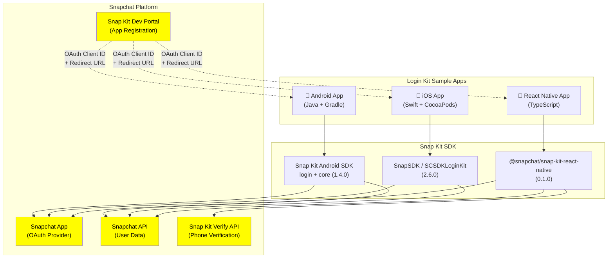

# 🏗️ 2. High-Level Discovery — Snapchat Login Kit Sample

> Understand the big picture: what the project does, how it's structured, and what technologies it uses.

---

## Project Purpose & Context

**Snapchat Login Kit Sample** is an official reference implementation by Snap Inc. demonstrating how to integrate **Snapchat Login Kit** into mobile applications. Login Kit lets users authenticate with Snapchat via OAuth2 and bring their Snapchat identity (display name, Bitmoji avatar, external ID) into third-party apps.

| Field | Value |
|-------|-------|
| **Purpose** | Demonstrate Snapchat OAuth2 login integration across platforms |
| **Users** | Mobile developers integrating Snap Kit |
| **Repo** | https://github.com/Snapchat/login-kit-sample |
| **License** | Custom (see LICENSE) |
| **Maintainer** | Snap Inc. |

---

## Repository Structure

```
📦 login-kit-sample/
├── 📂 android/                    # Native Android sample app (Java)
│   ├── 📂 app/
│   │   ├── 📂 src/main/
│   │   │   ├── AndroidManifest.xml        # App config, OAuth client ID, redirect URL
│   │   │   ├── 📂 java/.../MainActivity.java  # Main login/logout logic
│   │   │   └── 📂 res/                    # Layouts, drawables, strings, scopes
│   │   └── build.gradle                   # App-level dependencies (Snap SDK, Glide)
│   ├── build.gradle                       # Project-level build (Snap Maven repo)
│   └── settings.gradle
├── 📂 ios/                        # Native iOS sample app (Swift)
│   ├── 📂 LoginKitSample/
│   │   ├── 📂 Classes/
│   │   │   ├── AppDelegate.swift          # URL scheme handler for OAuth callback
│   │   │   ├── LoginViewController.swift  # Login/logout UI + user data fetch
│   │   │   └── ViewController.swift       # Base view controller
│   │   ├── Info.plist                     # OAuth client ID, redirect URL, scopes
│   │   └── 📂 Base.lproj/                # Storyboards (Main, LaunchScreen)
│   ├── Podfile                            # CocoaPods: SnapSDK/SCSDKLoginKit
│   └── Podfile.lock
├── 📂 react-native/              # React Native cross-platform sample
│   ├── App.tsx                            # Main app component (login, verify, user data)
│   ├── index.js                           # App registry entry point
│   ├── package.json                       # Dependencies (@snapchat/snap-kit-react-native)
│   ├── 📂 android/                        # RN Android platform config
│   ├── 📂 ios/                            # RN iOS platform config
│   └── 📂 __tests__/                      # Jest tests
├── README.md                      # Top-level links to each platform sample
└── LICENSE                        # License & attribution
```

---

## Tech Stack & Dependencies

### Android

| Category | Technology | Version |
|----------|-----------|---------|
| **Language** | Java | — |
| **Build System** | Gradle | 3.4.1 |
| **Min SDK** | API 19 (Android 4.4) | — |
| **Target SDK** | API 29 (Android 10) | — |
| **Snap Kit SDK** | `com.snapchat.kit.sdk:login` + `core` | 1.4.0 |
| **Image Loading** | Glide | 4.10.0 |
| **UI** | AndroidX AppCompat + ConstraintLayout | 1.1.x |
| **Testing** | JUnit + Espresso | 4.12 / 3.2.0 |

### iOS

| Category | Technology | Version |
|----------|-----------|---------|
| **Language** | Swift | — |
| **Platform** | iOS 12.0+ | — |
| **Dependency Manager** | CocoaPods | — |
| **Snap Kit SDK** | `SnapSDK/SCSDKLoginKit` | 2.6.0 |
| **UI** | UIKit + Storyboards | — |

### React Native

| Category | Technology | Version |
|----------|-----------|---------|
| **Language** | TypeScript | 4.4.2 |
| **Framework** | React Native | 0.63.4 |
| **React** | React | 16.13.1 |
| **Snap Kit SDK** | `@snapchat/snap-kit-react-native` | ^0.1.0 |
| **Testing** | Jest | 25.1.0 |
| **Linting** | ESLint | 6.5.1 |
| **Bundler** | Metro | 0.59.0 |

---

## Architecture Diagram



---

## Key Configuration Files

| File | Platform | What It Controls |
|------|----------|-----------------|
| `android/app/src/main/AndroidManifest.xml` | Android | OAuth client ID, redirect URL, scopes, intent filters |
| `android/app/src/main/res/values/arrays.xml` | Android | OAuth2 scope declarations |
| `android/app/build.gradle` | Android | Snap Kit SDK version, dependencies |
| `android/build.gradle` | Android | Snap Maven repository URL |
| `ios/LoginKitSample/Info.plist` | iOS | SCSDKClientId, SCSDKRedirectUrl, SCSDKScopes, URL schemes |
| `ios/Podfile` | iOS | SnapSDK pod version |
| `react-native/package.json` | React Native | JS dependencies and scripts |
| `react-native/android/app/src/main/AndroidManifest.xml` | RN Android | OAuth config (same as native Android) |
| `react-native/ios/ReactNativeLoginKitDemo/Info.plist` | RN iOS | OAuth config (same as native iOS) |

---

## OAuth2 Scopes Used

All three sample apps request the same user data scopes:

| Scope URL | Data Retrieved |
|-----------|---------------|
| `https://auth.snapchat.com/oauth2/api/user.display_name` | User's Snapchat display name |
| `https://auth.snapchat.com/oauth2/api/user.external_id` | Unique external identifier |
| `https://auth.snapchat.com/oauth2/api/user.bitmoji.avatar` | User's Bitmoji 2D avatar URL |

---

*Next → [3-MODULE-DEEP-DIVE.md](3-MODULE-DEEP-DIVE.md)*
