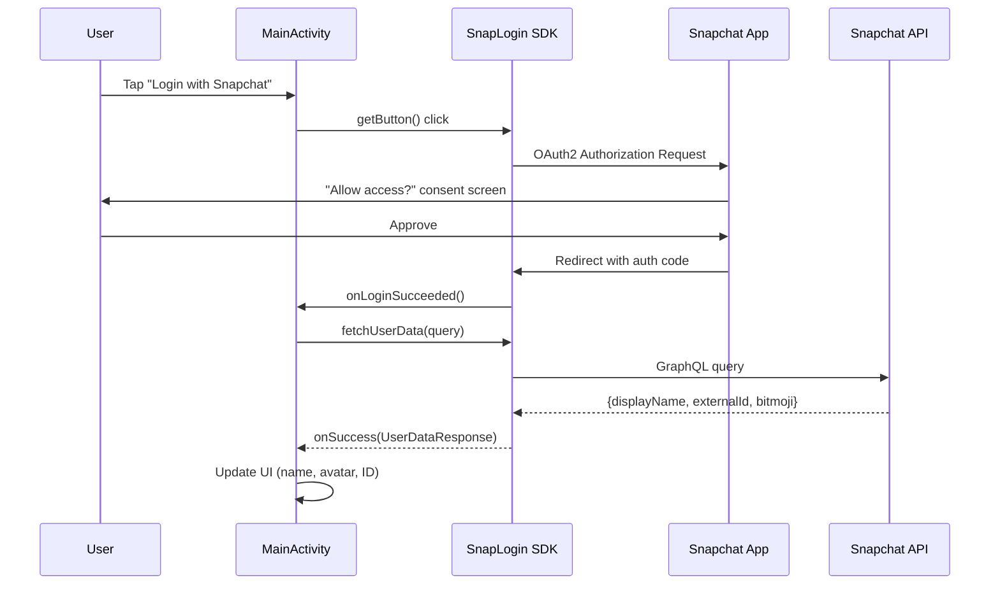
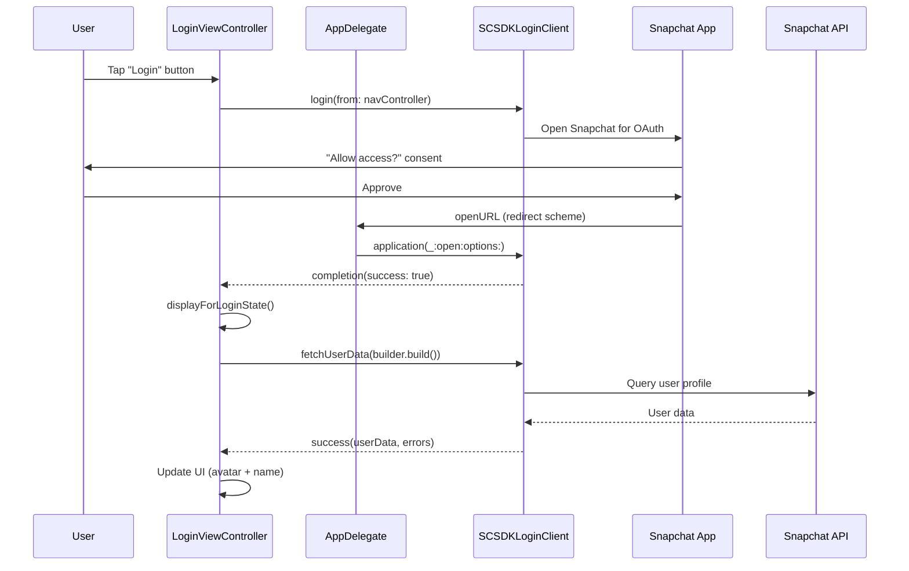
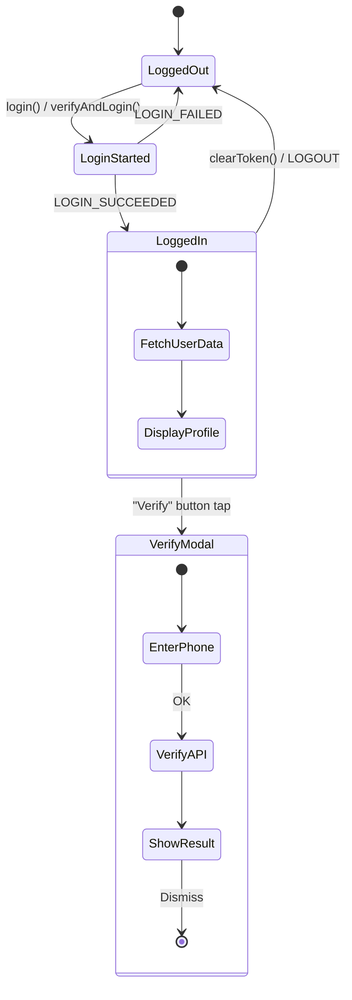
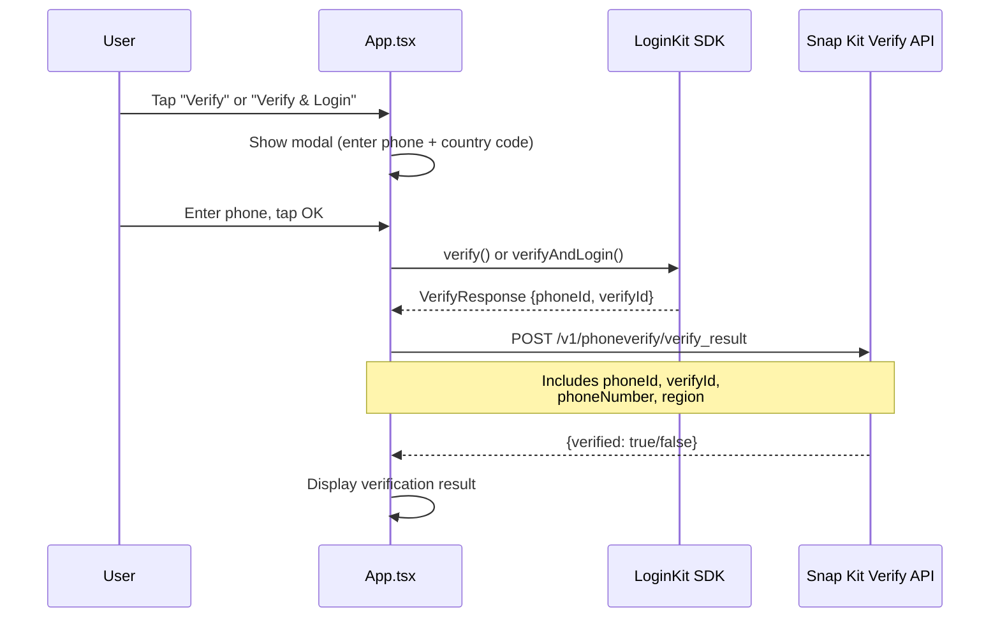
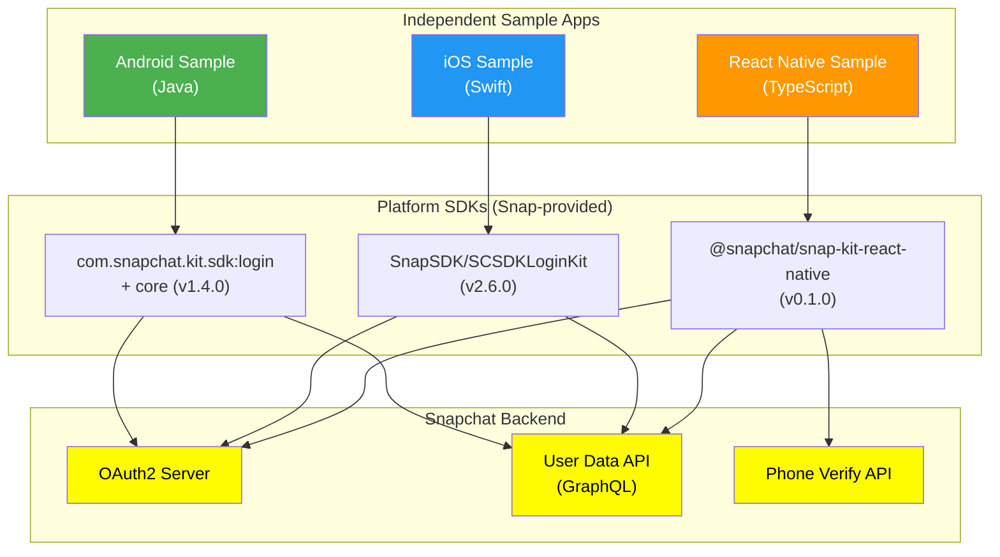

# 🔬 3. Module Deep-Dive — Snapchat Login Kit Sample

> Go module by module. Understand each platform sample's responsibility, interfaces, and internal logic.

---

## Module Overview

This project contains **three independent sample apps** — one per platform. Each demonstrates the same Login Kit integration pattern adapted to its platform's idioms.

| Module | Language | Entry Point | Key SDK |
|--------|----------|-------------|---------|
| `android/` | Java | `MainActivity.java` | `com.snapchat.kit.sdk` (1.4.0) |
| `ios/` | Swift | `AppDelegate.swift` + `LoginViewController.swift` | `SCSDKLoginKit` (2.6.0) |
| `react-native/` | TypeScript | `App.tsx` | `@snapchat/snap-kit-react-native` (0.1.0) |

---

## Module 1: Android Sample (`android/`)

### Purpose
Demonstrates Snapchat Login Kit integration in a native Android app using Java. Shows login, logout, user data fetching (display name, external ID, Bitmoji avatar).

### Key Files

| File | Purpose |
|------|---------|
| `app/src/main/java/.../MainActivity.java` | **Core logic** — login state listener, user data fetch, UI updates |
| `app/src/main/AndroidManifest.xml` | OAuth client ID, redirect URL, scopes, SnapKitActivity intent filter |
| `app/src/main/res/values/arrays.xml` | OAuth2 scope declarations (`snap_connect_scopes`) |
| `app/build.gradle` | Snap Kit SDK version (`1.4.0`), dependencies (Glide, AppCompat) |
| `build.gradle` | Project-level Snap Maven repository registration |

### Public API / Key Interfaces

| Class/Method | What It Does |
|-------------|-------------|
| `SnapLogin.getButton(context, viewGroup)` | Creates the official "Login with Snapchat" button |
| `SnapLogin.getLoginStateController(context)` | Returns controller to listen for login state changes |
| `SnapLogin.isUserLoggedIn(context)` | Checks if user currently has valid auth token |
| `SnapLogin.fetchUserData(context, query, variables, callback)` | Fetches user profile data via GraphQL query |
| `SnapLogin.getAuthTokenManager(context).clearToken()` | Logs user out by clearing OAuth token |
| `LoginStateController.OnLoginStateChangedListener` | Callback interface: `onLoginSucceeded()`, `onLoginFailed()`, `onLogout()` |
| `FetchUserDataCallback` | Callback: `onSuccess(UserDataResponse)`, `onFailure(isNetworkError, statusCode)` |

### Data Flow



### Design Patterns
- **Observer Pattern** — `OnLoginStateChangedListener` for login events
- **Callback Pattern** — `FetchUserDataCallback` for async user data
- **SDK-Managed UI** — Login button created by SDK (`SnapLogin.getButton()`)

---

## Module 2: iOS Sample (`ios/`)

### Purpose
Demonstrates Snapchat Login Kit integration in a native iOS app using Swift and UIKit with Storyboards.

### Key Files

| File | Purpose |
|------|---------|
| `LoginKitSample/Classes/AppDelegate.swift` | URL scheme handler — passes OAuth redirect to `SCSDKLoginClient` |
| `LoginKitSample/Classes/LoginViewController.swift` | **Core logic** — login button handler, user data fetch, UI state management |
| `LoginKitSample/Classes/ViewController.swift` | Base view controller (minimal) |
| `LoginKitSample/Info.plist` | `SCSDKClientId`, `SCSDKRedirectUrl`, `SCSDKScopes`, URL schemes |
| `Podfile` | Declares `SnapSDK` 2.6.0 dependency (SCSDKLoginKit subspec) |

### Public API / Key Interfaces

| Class/Method | What It Does |
|-------------|-------------|
| `SCSDKLoginClient.login(from:completion:)` | Initiates OAuth2 login flow from a view controller |
| `SCSDKLoginClient.application(_:open:options:)` | Handles OAuth redirect URL (called in `AppDelegate`) |
| `SCSDKLoginClient.isUserLoggedIn` | Property — checks if user has valid session |
| `SCSDKLoginClient.clearToken()` | Clears stored OAuth token (logout) |
| `SCSDKLoginClient.fetchUserData(with:success:failure:)` | Fetches user profile using `SCSDKUserDataQueryBuilder` |
| `SCSDKUserDataQueryBuilder` | Builder pattern to specify which fields to retrieve |

### Data Flow



### Design Patterns
- **Delegation** — `AppDelegate` handles URL callbacks
- **Builder Pattern** — `SCSDKUserDataQueryBuilder` for composing data queries
- **MVC** — View controllers with Storyboard-connected IBOutlets/IBActions

---

## Module 3: React Native Sample (`react-native/`)

### Purpose
Cross-platform Login Kit integration using React Native with TypeScript. Includes additional **Snapchat Verify** (phone verification) functionality not present in the native samples.

### Key Files

| File | Purpose |
|------|---------|
| `App.tsx` | **Single-file app** — all login, logout, verify, and user data logic |
| `index.js` | App registry entry point |
| `package.json` | Dependencies: `@snapchat/snap-kit-react-native`, React, React Native |
| `android/app/src/main/AndroidManifest.xml` | Android OAuth config |
| `ios/ReactNativeLoginKitDemo/Info.plist` | iOS OAuth config |

### Public API / Key Interfaces (from `@snapchat/snap-kit-react-native`)

| Method | What It Does |
|--------|-------------|
| `LoginKit.login()` | Initiates Snapchat OAuth2 login |
| `LoginKit.clearToken()` | Logs user out |
| `LoginKit.isUserLoggedIn()` | Returns `Promise<boolean>` |
| `LoginKit.refreshAccessToken()` | Returns `Promise<string>` — refreshed access token |
| `LoginKit.hasAccessToScope(scope)` | Checks if a specific OAuth scope is authorized |
| `LoginKit.fetchUserData(query, variables)` | GraphQL query for user data |
| `LoginKit.verify(phoneNumber, countryCode)` | Phone verification only |
| `LoginKit.verifyAndLogin(phoneNumber, countryCode)` | Phone verification + login combined |

### Login State Events

| Event | When Emitted |
|-------|-------------|
| `LOGIN_KIT_LOGIN_STARTED` | Login flow begins |
| `LOGIN_KIT_LOGIN_SUCCEEDED` | User successfully authenticated |
| `LOGIN_KIT_LOGIN_FAILED` | Login attempt failed |
| `LOGIN_KIT_LOGOUT` | User logged out |

### Component State



### Unique Feature: Phone Verification (Snapchat Verify)

The React Native sample includes a phone verification flow not present in the native samples:



---

## Inter-Module Dependency Map

The three modules are **completely independent** — they share no code. Each is a standalone sample app that integrates with the same Snapchat Login Kit API through platform-specific SDKs.



---

## GraphQL Query Used Across All Platforms

All three samples use the same GraphQL query to fetch user data:

```graphql
{
  me {
    bitmoji {
      avatar
    }
    displayName
    externalId       # Android includes this; iOS/RN may omit
  }
}
```

---

*Next → [4-FLOW-TRACING.md](4-FLOW-TRACING.md)*
