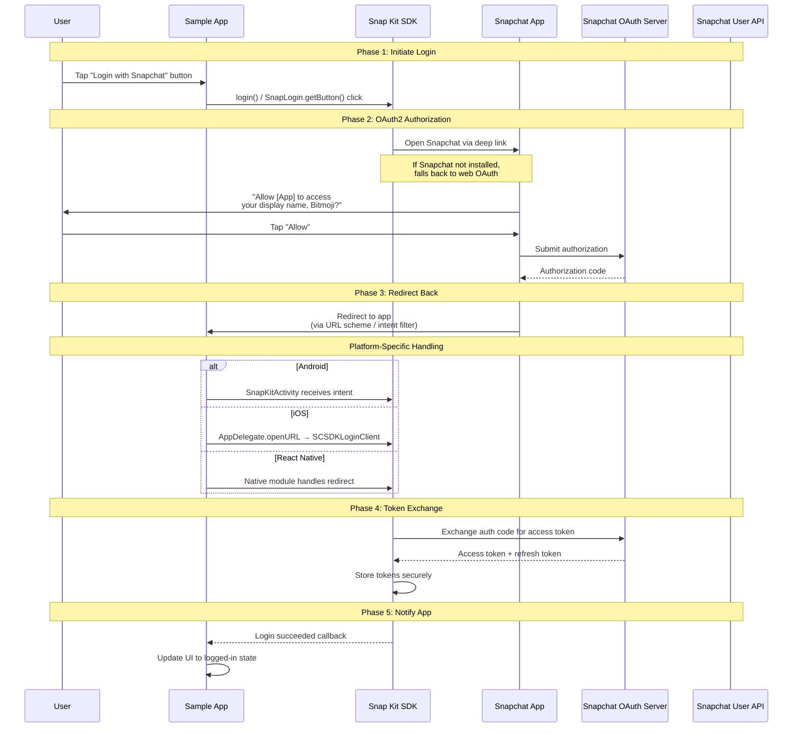
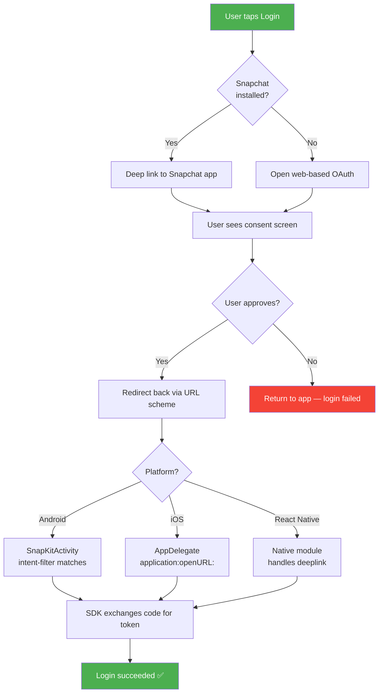
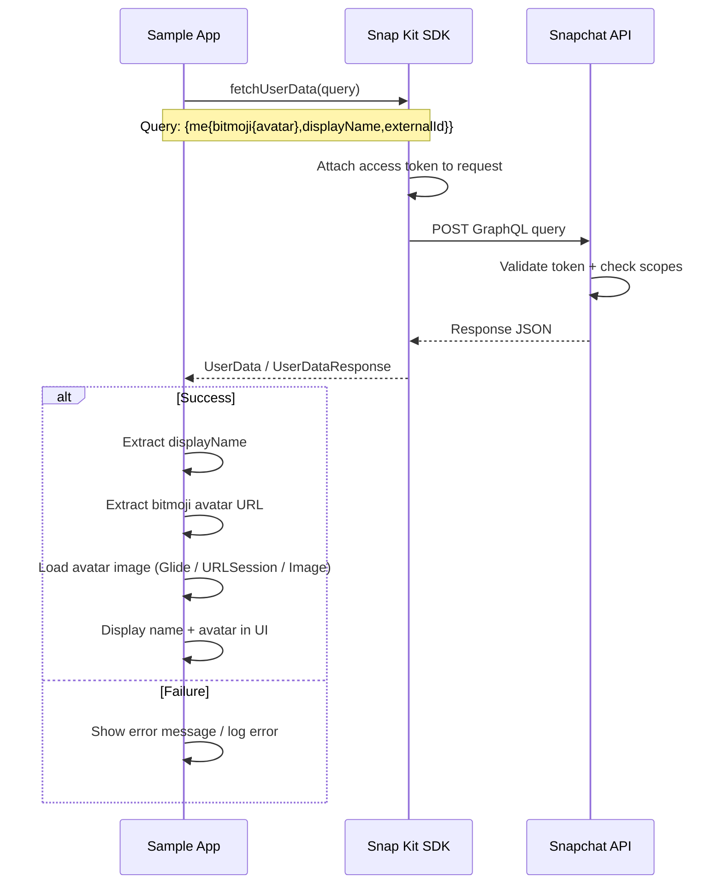
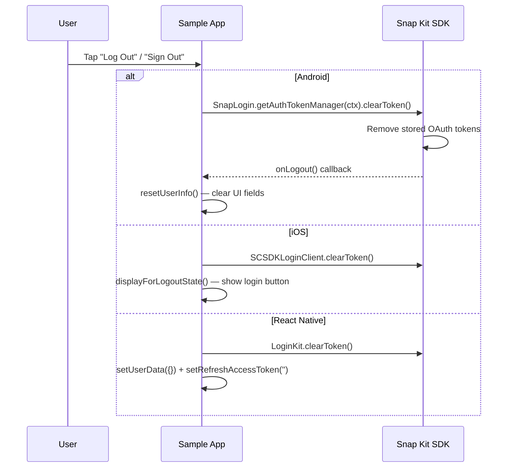
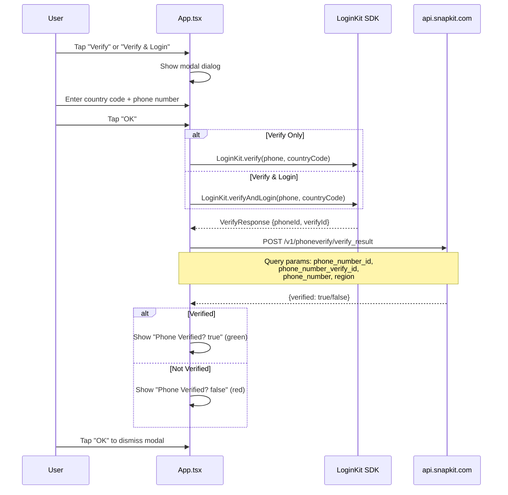
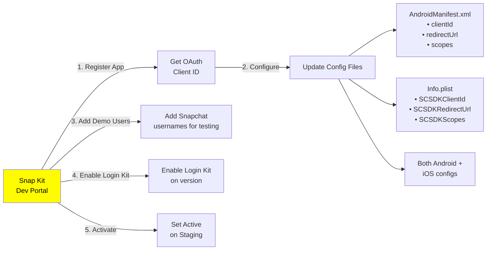

# 🔄 4. End-to-End Flow Tracing — Snapchat Login Kit Sample

> Connect the dots. Trace real user scenarios through the entire system.

---

## Critical User Flows

This project has **4 key user flows**:

| # | Flow | Platforms |
|---|------|-----------|
| 1 | Login with Snapchat (OAuth2) | Android, iOS, React Native |
| 2 | Fetch User Profile Data | Android, iOS, React Native |
| 3 | Logout / Clear Token | Android, iOS, React Native |
| 4 | Phone Verification (Snapchat Verify) | React Native only |

---

## Flow 1: Login with Snapchat (OAuth2)

### What the User Does
User taps "Login with Snapchat" → app redirects to Snapchat → user approves access → Snapchat redirects back to the app with an authorization code → SDK exchanges it for an access token.

### Complete End-to-End Sequence



### Entry Points by Platform

| Platform | Entry Point | Callback Handler |
|----------|------------|-----------------|
| Android | `SnapLogin.getButton()` click | `OnLoginStateChangedListener.onLoginSucceeded()` |
| iOS | `SCSDKLoginClient.login(from:completion:)` | Completion closure `(success, error)` |
| React Native | `LoginKit.login()` | `LOGIN_KIT_LOGIN_SUCCEEDED` event listener |

### OAuth Redirect Flow



---

## Flow 2: Fetch User Profile Data

### Trigger
Automatically called after a successful login.

### GraphQL Query
```graphql
{
  me {
    bitmoji { avatar }
    displayName
    externalId
  }
}
```

### Sequence



### Data Retrieved

| Field | Type | Where Displayed |
|-------|------|-----------------|
| `displayName` | String | Name label on profile view |
| `externalId` | String | External ID label (Android only shows this) |
| `bitmoji.avatar` | URL (String) | Avatar image view (loaded async) |

---

## Flow 3: Logout / Clear Token

### Sequence



---

## Flow 4: Phone Verification (React Native Only)

### Trigger
User taps "Verify" or "Verify & Login" button.

### Complete Flow



---

## Error Handling Across Platforms

| Scenario | Android | iOS | React Native |
|----------|---------|-----|-------------|
| Login fails | `onLoginFailed()` → sets text "not logged in" | Completion closure `error` → displays in `messageLabel` | `LOGIN_KIT_LOGIN_FAILED` event → updates `lastLoginState` |
| User data fetch fails | `onFailure(isNetworkError, statusCode)` → logs error | `failure(error, isUserLoggedOut)` → prints error | `.catch(error)` → sets `userData` to error |
| Verify fails | N/A | N/A | `.catch(error)` → sets `verifyError` + shows in modal |
| No Bitmoji | Checks `meData.getBitmojiData() != null` | Returns empty string → no image loaded | Checks `userData?.bitmojiAvatar` → shows "No Bitmoji avatar" |

---

## Configuration & Environment

### OAuth Configuration (Required Before Running)



---

*Next → [5-REUSABLE-PROMPTS.md](5-REUSABLE-PROMPTS.md)*
