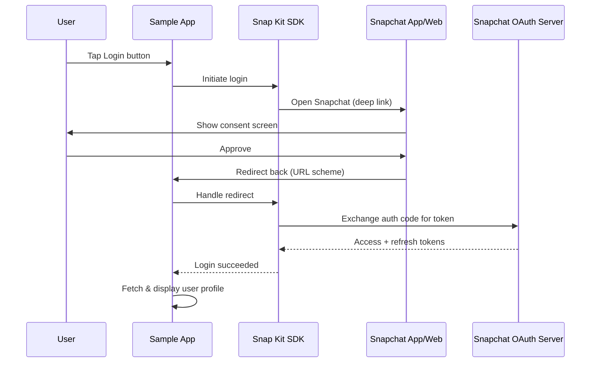
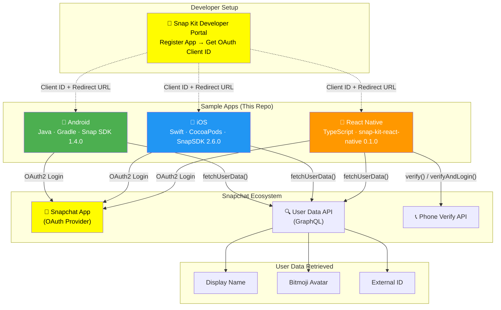

# 📐 6. Filled Output Templates — Snapchat Login Kit Sample

> Project-specific documentation using the output templates from the onboarding kit.

---

## Template 1: Project Summary Card

# Snapchat Login Kit Sample — Summary Card

| Field | Value |
|-------|-------|
| **Purpose** | Demonstrate Snapchat OAuth2 login integration for mobile apps across 3 platforms |
| **Users** | Mobile developers integrating Snap Kit into their apps |
| **Tech Stack** | Java (Android), Swift (iOS), TypeScript/React Native (Cross-platform) |
| **Repo** | https://github.com/Snapchat/login-kit-sample |
| **Main Branch** | `master` |
| **Build Command (Android)** | `./gradlew assembleDebug` (from `android/`) |
| **Build Command (iOS)** | `pod install && xcodebuild` (from `ios/`) |
| **Build Command (RN)** | `yarn install && yarn android` or `yarn ios` (from `react-native/`) |
| **Test Command (RN)** | `yarn test` |
| **CI/CD** | None configured |
| **Deployed To** | N/A — Sample app (runs locally on device/emulator) |
| **Docs** | Each platform has its own `README.md`; [Snap Kit Docs](https://kit.snapchat.com/docs) |
| **External Dependencies** | Snapchat App, Snap Kit Developer Portal |

---

## Template 2: Module Documentation

### Module: Android Sample (`android/`)

#### Purpose
Native Android app demonstrating Snapchat Login Kit: user login via OAuth2, fetching user profile (display name, external ID, Bitmoji avatar), and logout.

#### Key Files
| File | Purpose |
|------|---------|
| `app/src/main/java/.../MainActivity.java` | Core activity — login listener, user data fetch, UI management |
| `app/src/main/AndroidManifest.xml` | OAuth client ID, redirect URL, scopes, SnapKitActivity registration |
| `app/build.gradle` | Dependencies: Snap Kit SDK 1.4.0, Glide 4.10.0 |
| `build.gradle` | Snap Maven repository configuration |

#### Public API
| Method | Parameters | Returns | Description |
|--------|-----------|---------|-------------|
| `SnapLogin.getButton(ctx, parent)` | Context, ViewGroup | View | Official "Login with Snapchat" button |
| `SnapLogin.fetchUserData(ctx, query, vars, cb)` | Context, GraphQL string, variables, callback | void | Fetch user profile data |
| `SnapLogin.isUserLoggedIn(ctx)` | Context | boolean | Check login status |
| `SnapLogin.getAuthTokenManager(ctx).clearToken()` | Context | void | Logout |

#### Dependencies
- **Depends on**: Snap Kit SDK (login + core), Glide, AndroidX
- **Depended by**: None (standalone sample)

---

### Module: iOS Sample (`ios/`)

#### Purpose
Native iOS app demonstrating Snapchat Login Kit with Swift and UIKit: OAuth login, profile display, and logout.

#### Key Files
| File | Purpose |
|------|---------|
| `LoginKitSample/Classes/AppDelegate.swift` | Handles OAuth redirect URL callback |
| `LoginKitSample/Classes/LoginViewController.swift` | Login/logout UI, user data fetch, avatar display |
| `LoginKitSample/Info.plist` | OAuth config (SCSDKClientId, SCSDKRedirectUrl, scopes) |
| `Podfile` | SnapSDK 2.6.0 dependency |

#### Public API
| Method | Parameters | Returns | Description |
|--------|-----------|---------|-------------|
| `SCSDKLoginClient.login(from:completion:)` | UIViewController, closure | void | Start OAuth login |
| `SCSDKLoginClient.fetchUserData(with:success:failure:)` | Query, success/failure closures | void | Fetch user data |
| `SCSDKLoginClient.isUserLoggedIn` | — | Bool | Check login status |
| `SCSDKLoginClient.clearToken()` | — | void | Logout |

#### Dependencies
- **Depends on**: SnapSDK/SCSDKLoginKit (CocoaPods)
- **Depended by**: None (standalone sample)

---

### Module: React Native Sample (`react-native/`)

#### Purpose
Cross-platform app demonstrating Login Kit + Snapchat Verify via React Native. Includes phone verification, which native samples don't have.

#### Key Files
| File | Purpose |
|------|---------|
| `App.tsx` | Single-file app: login, logout, verify, fetch user data, UI |
| `index.js` | App registry entry |
| `package.json` | Dependencies: @snapchat/snap-kit-react-native |

#### Public API
| Method | Parameters | Returns | Description |
|--------|-----------|---------|-------------|
| `LoginKit.login()` | — | void | Start OAuth login |
| `LoginKit.clearToken()` | — | void | Logout |
| `LoginKit.fetchUserData(query, vars)` | GraphQL string, variables | Promise\<UserData\> | Fetch user data |
| `LoginKit.verify(phone, country)` | phone, country code | Promise\<VerifyResponse\> | Phone verification only |
| `LoginKit.verifyAndLogin(phone, country)` | phone, country code | Promise\<VerifyResponse\> | Verify + login |

#### Dependencies
- **Depends on**: @snapchat/snap-kit-react-native, React, React Native
- **Depended by**: None (standalone sample)

---

## Template 3: Flow Documentation

### Flow: Login with Snapchat

#### Trigger
User taps "Login with Snapchat" button in any of the three sample apps.

#### Happy Path

#### Error Scenarios
| Error | Cause | Handling | User Impact |
|-------|-------|----------|-------------|
| Login failed | User denies consent, network error | `onLoginFailed()` / error callback | Stays on login screen, error message shown |
| Redirect not received | Wrong URL scheme / intent filter | App never receives callback | App appears stuck; user must reopen |
| User data null | Invalid scopes, token expired | Null checks in code | Blank profile; "No Bitmoji avatar" shown |
| No Snapchat installed | App not on device | SDK falls back to web OAuth | Web-based consent flow (less seamless) |

#### Data Changes
| Entity | Operation | Fields Affected |
|--------|-----------|-----------------|
| OAuth Token | CREATE | Access token, refresh token (stored by SDK) |
| User Session | READ | Display name, external ID, Bitmoji avatar URL |

#### Side Effects
- ✅ OAuth tokens stored in device secure storage (managed by SDK)
- ✅ User profile data fetched from Snapchat API
- ❌ No emails sent
- ❌ No events published
- ❌ No backend database writes (client-only app)

---

## Mermaid Architecture Summary

---

## Glossary

| Term | Meaning |
|------|---------|
| **Login Kit** | Snap Kit module that enables OAuth2 authentication with Snapchat |
| **Snap Kit** | Snapchat's developer platform; includes Login Kit, Creative Kit, Bitmoji Kit, etc. |
| **OAuth Client ID** | Unique identifier for your app, obtained from the Snap Kit Developer Portal |
| **Redirect URL** | URL scheme that Snapchat uses to redirect back to your app after OAuth |
| **Scopes** | Permissions your app requests (display_name, external_id, bitmoji.avatar) |
| **SCSDKLoginKit** | iOS framework for Snapchat Login Kit (part of SnapSDK pod) |
| **SnapLogin** | Android class providing static methods for login/logout/user data |
| **LoginKit** | React Native module wrapping native Snap Kit SDKs |
| **GraphQL Query** | Query format used to request specific user data fields from Snapchat API |
| **Demo Users** | Snapchat accounts authorized to test your app on the Staging environment |
| **Staging** | Development environment — works with Development client ID + Demo Users only |
| **Production** | Live environment — works with any Snapchat account (requires app approval) |
| **Bitmoji** | Personalized avatar linked to a Snapchat account |
| **External ID** | Unique, app-scoped identifier for a Snapchat user (different per app) |
| **Snapchat Verify** | Phone number verification service via Snapchat (React Native sample only) |
| **SnapKitActivity** | Android activity that handles OAuth redirect intents |
| **singleTask** | Android launch mode ensuring only one instance of SnapKitActivity exists |
| **URL Scheme** | Custom protocol (e.g., `snapkitexample://`) registered by the app for deep links |

---

## Important Files — Top 10

| # | File | Why It Matters |
|---|------|---------------|
| 1 | `android/.../MainActivity.java` | Core Android logic — login, data fetch, UI |
| 2 | `ios/.../LoginViewController.swift` | Core iOS logic — login, data fetch, UI |
| 3 | `react-native/App.tsx` | Complete React Native app in one file |
| 4 | `android/.../AndroidManifest.xml` | Android OAuth config + intent filters |
| 5 | `ios/LoginKitSample/Info.plist` | iOS OAuth config + URL schemes |
| 6 | `ios/.../AppDelegate.swift` | iOS OAuth redirect handler |
| 7 | `android/app/build.gradle` | Android SDK version + dependencies |
| 8 | `ios/Podfile` | iOS SDK version (SnapSDK 2.6.0) |
| 9 | `react-native/package.json` | RN dependencies + scripts |
| 10 | `android/build.gradle` | Snap Maven repository registration |

---

*🎉 You've completed the onboarding for Snapchat Login Kit Sample! Happy coding!*
