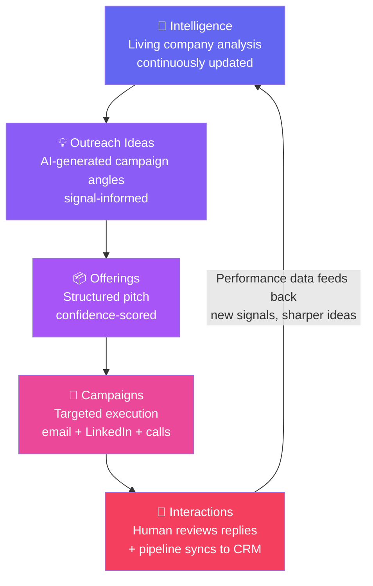
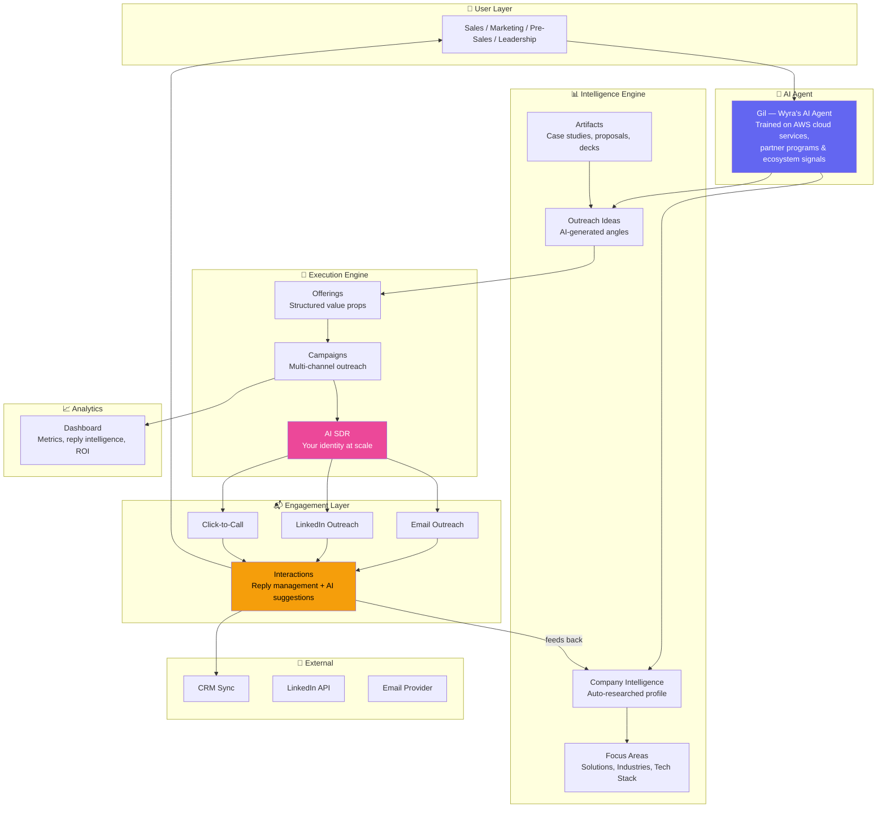
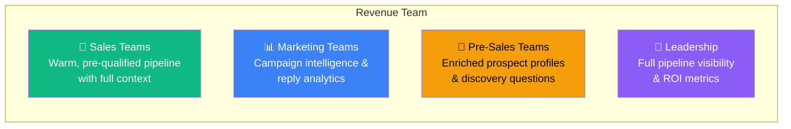
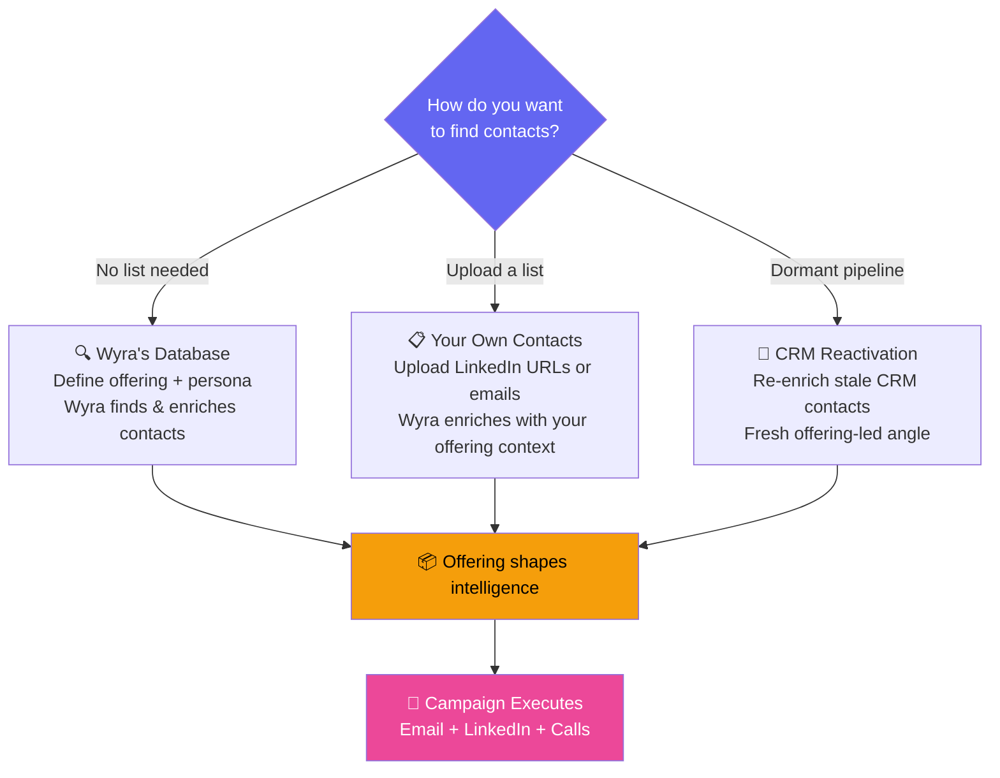

# 🏗️ Wyra — High-Level Architecture & Platform Overview

> **What is Wyra?** The GTM (Go-To-Market) Intelligence Layer — a pre-CRM platform that turns market signals into targeted outreach with humans in control at every decision point.

---

## 🎯 What Problem Does Wyra Solve?

Effective GTM needs three things at once:

1. **Know your value** clearly (what you sell and why it matters)
2. **Know who needs it** and why now (intelligence)
3. **Execute outreach** with relevance at scale (campaigns)

No single tool did all three with ecosystem intelligence built in. **Wyra fills that gap.**

---

## 🧠 The Wyra Intelligence Loop

This is the **core concept** — everything in the platform revolves around this self-improving loop:

> ☝️ **Key insight:** The loop doesn't reset — it **compounds**. Every campaign produces interaction data that sharpens the next wave of ideas.

---

## 🏠 Platform Architecture

---

## 🧩 Platform Modules at a Glance

| Module | What It Does | Key Concept |
|--------|-------------|-------------|
| **Intelligence** | Auto-researches your company, generates outreach ideas | Living analysis — never static |
| **Outreach Ideas** | AI-generated campaign angles from signals + your artifacts | Like/dislike trains the engine |
| **Offerings** | Structured value propositions with confidence scoring | Your pitch, refined by AI |
| **Campaigns** | Multi-channel execution (email + LinkedIn + calls) | 5-step wizard: Value Prop → Persona → Why Now → Messaging → Launch |
| **AI SDR** | Your professional identity running outreach at scale | Not a bot — it's *you*, amplified |
| **Interactions** | Reply management with AI-suggested responses | Human-in-the-loop — you close, AI opens |
| **Lists** | Contact management — upload CSV, use Wyra's DB, or CRM reactivation | Three paths into campaigns |
| **Dashboard** | Real-time metrics, reply intelligence, ROI | Your 2-minute morning briefing |
| **Settings & Admin** | Domains, email accounts, team management | Infrastructure for deliverability |

---

## 🔑 Key Concepts to Know

### 🤖 Gil — The AI Agent
Gil is Wyra's AI agent, trained on **AWS cloud services, partner programs, and ecosystem signals**. Gil:
- Analyzes your company and market position
- Generates campaign ideas with full offering scaffolding
- Scores contacts for relevance
- Executes outreach across email, LinkedIn, and calls

Gil is the **first** in Wyra's verticalized agent family. More agents (for other ecosystems) are coming.

### 🧑‍💼 AI SDR (Sales Development Representative)
- **Not a bot** — it's YOUR identity (your name, email, LinkedIn) executing at scale
- Each team member gets their own AI SDR
- Manages sending reputation automatically
- Goes through a **14-day warmup** before full-volume sending

### 🔄 Human-in-the-Loop
Wyra is **not** fire-and-forget:
- AI executes outreach → replies surface in **Interactions**
- Humans review, edit, and approve every response
- Hot leads are flagged automatically
- AI suggests replies, but **you decide**

---

## 👥 Who Uses Wyra?

---

## 🚦 Three Ways to Start a Campaign

---

## ⚡ What Wyra is NOT

| ❌ NOT this | ✅ What it IS |
|---|---|
| Not a CRM | Operates **before** the CRM, feeding it qualified pipeline |
| Not a data provider | Enrichment is tied to **your specific offering context** |
| Not marketing automation | Generates the **strategy**, not just the sends |
| Not fire-and-forget | **Humans stay in the decision seat** at every step |

---

*Next → [3-MODULE-DEEP-DIVE.md](3-MODULE-DEEP-DIVE.md) — Detailed breakdown of each module*
