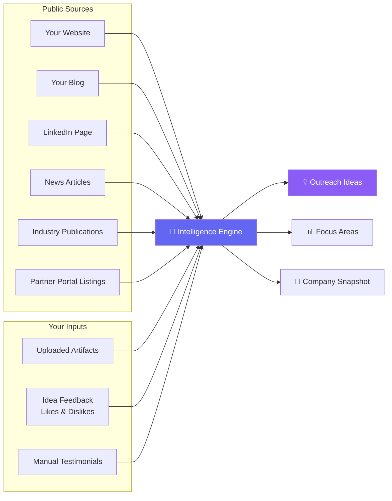
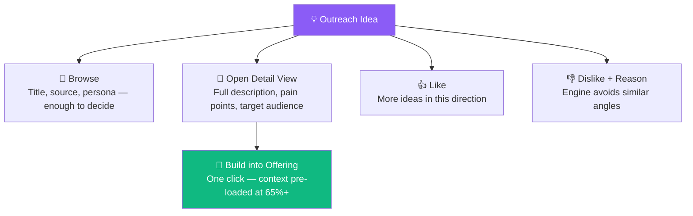
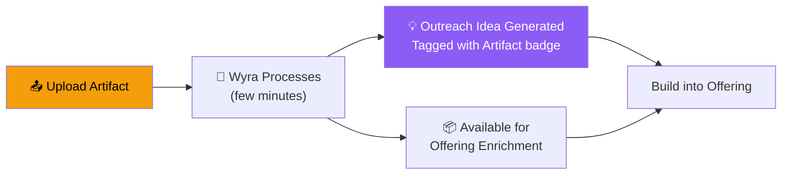
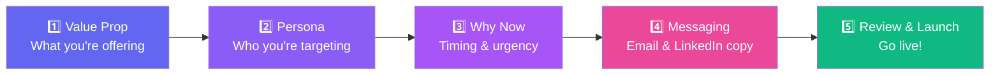
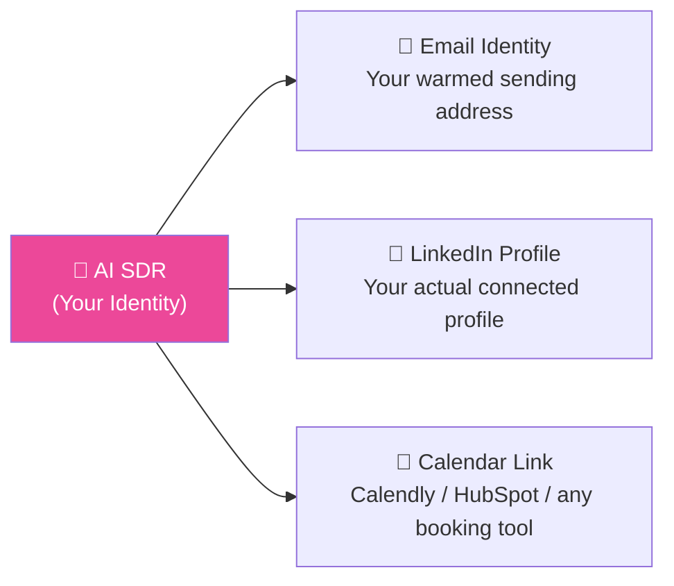
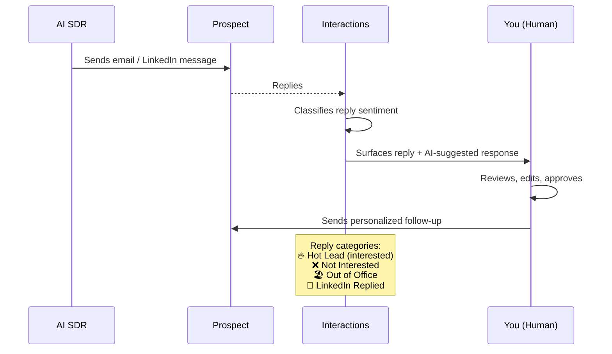
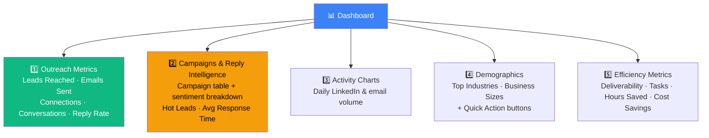
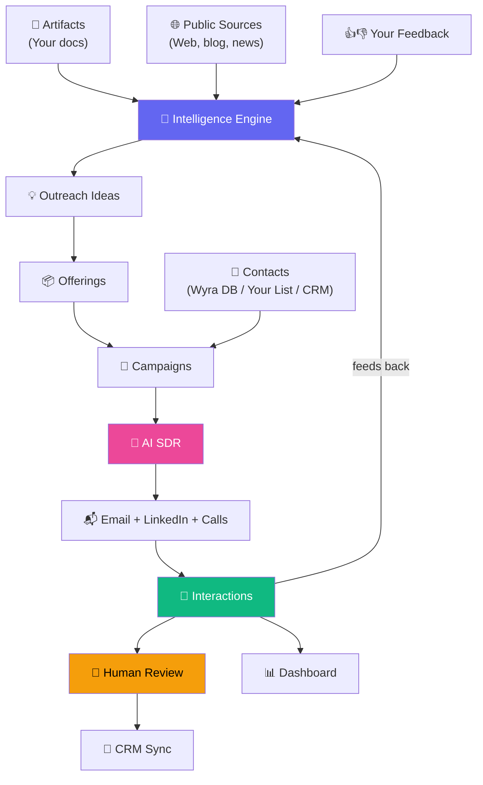

# 🔬 Wyra — Module Deep-Dive

> Every module explained: what it does, how it works, and how it connects to everything else.

---

## Module 1: 🧠 Intelligence

**Purpose:** Wyra's always-on research engine. It continuously monitors your company, market, and ecosystem — then turns what it finds into actionable outreach ideas.

### What's on the Intelligence Tab

| Section | What It Shows | Why It Matters |
|---------|--------------|----------------|
| **Company Snapshot** | Your value prop, specialties, HQ, employee count | How Wyra understands what you are |
| **Outreach Ideas** | AI-generated campaign angles (latest 6) | The core output — your next campaigns start here |
| **Focus Areas** | 3 charts: Solutions, Industries, Tech Stack | Inputs that determine which ideas get generated |
| **Customer Testimonials** | Auto-extracted + manually added social proof | Flows into offerings as credibility |
| **Recent Signals** *(coming soon)* | News, ecosystem announcements, company signals | Timely outreach triggers |
| **Leadership Team** *(coming soon)* | Key people at your company | Sender context personalization |

### Where Intelligence Comes From

### How You Train It

| Action | Effect |
|--------|--------|
| 👍 **Like an idea** | More ideas in the same direction |
| 👎 **Dislike with a reason** | Removes idea + trains engine to avoid similar angles |
| 📄 **Upload artifact** | Generates a grounded idea from real customer wins |
| 💬 **Add testimonial** | Flows into offerings as social proof |

> **The compounding effect:** Teams that actively like/dislike ideas and upload case studies see outreach ideas that feel custom-built — because they are.

---

## Module 2: 💡 Outreach Ideas

**Purpose:** AI-generated campaign angles — each one a ready-made suggestion with a target persona, industry focus, and enough context to become a full offering in minutes.

### Idea Sources (look for the badge!)

| Badge | Source | Best For |
|-------|--------|----------|
| 🟣 **Wyra's Intelligence** | Market signals + ecosystem trends | Broad angles you wouldn't have considered |
| 🟠 **Artifact** | Your case studies, proposals, decks | Most actionable — grounded in real wins |
| 🔵 **Blog** | Your published content, auto-crawled | Thought leadership angles |

### What You Can Do With Each Idea

> **Pro tip:** Prioritize **Artifact-sourced** ideas — they're built from real customer wins and have the sharpest targeting.

---

## Module 3: 📄 Artifacts

**Purpose:** Your uploaded case studies, proposals, and decks. They give Wyra evidence it can't find publicly.

### Supported File Types
`PDF` · `Word (.doc, .docx)` · `PowerPoint (.ppt, .pptx)`

### What to Upload

| Document Type | What Wyra Extracts | Best For |
|--------------|-------------------|----------|
| **Case studies** | Client, problem, outcome, metrics | Testimonials, proof points, industry ideas |
| **Proposals/SOWs** | Pain points, solutions, value delivered | Pain points, solution descriptions |
| **Customer decks** | Competitive positioning, statistics | Differentiators, campaign angles |
| **Whitepapers** | Industry expertise, insights | Industry-specific ideas |

### How Artifacts Flow Through the System

> ⚠️ **Don't upload duplicates** — each is processed independently. Delete the old version before uploading an update.

---

## Module 4: 📦 Offerings

**Purpose:** Structured value propositions — your pitch, refined by AI with confidence scoring.

An offering is what you sell, packaged for a specific audience. It contains:
- **Value proposition** — what you deliver
- **Pain points** — what the target is struggling with
- **Solutions** — how you solve it
- **Outcomes** — what they get
- **Social proof** — testimonials and metrics

When you build an offering from an Outreach Idea, **65%+ of the content is pre-populated** by AI.

---

## Module 5: 🚀 Campaigns

**Purpose:** Multi-channel outreach execution — email + LinkedIn + calls — using the 5-step wizard.

### The Campaign Wizard

### Two Paths Into a Campaign

| Path | What Happens | Wizard Steps |
|------|-------------|-------------|
| **Wyra's Intelligence** | Wyra finds prospects from its database | All 5 steps |
| **Use a List** | Upload CSV or select existing list | Persona step skipped |

### After Launch Timeline

| When | What to Check |
|------|--------------|
| **First 24-48 hrs** | Is campaign Active? Early metrics populating? |
| **Day 3-5** | First replies in Interactions → follow up personally |
| **Week 1** | Reply Intelligence → Is messaging resonating? |
| **Week 2+** | Launch a second campaign — iterate and compound |

---

## Module 6: 🤖 AI SDR

**Purpose:** Your professional identity — your name, email, LinkedIn — executing outreach at scale autonomously.

### What an AI SDR Includes

### Key Rules
- **One AI SDR per person** — tied to a real team member
- **14-day warmup** required before full-volume sending
- Can be assigned to **multiple campaigns** simultaneously
- More AI SDRs = more parallel outreach = faster pipeline

### The 14-Day Warmup

```mermaid
gantt
    title AI SDR Warmup Timeline
    dateFormat X
    axisFormat %s

    section Warmup
    Low volume sending begins        :a1, 0, 3
    Gradual volume ramp              :a2, 3, 11
    Full capacity reached            :a3, 11, 14

    section What You Should Do
    Build offerings & upload artifacts :b1, 0, 14
    Launch campaigns (run at warmup pace) :b2, 2, 14
```

> **Don't wait!** Launch campaigns during warmup — they queue and execute at warmup pace. By Day 14, you're already running.

---

## Module 7: 💬 Interactions

**Purpose:** Where every reply surfaces — with full context, conversation history, and AI-suggested responses.

### How It Works

### Reply Categories

| Category | What It Means | What to Do |
|----------|--------------|------------|
| 🔥 **Hot Lead / Interested** | Positive intent | Step in personally — fast |
| ❌ **Not Interested** | Declined | No further outreach sent automatically |
| 🏖️ **Out of Office** | Auto-reply detected | Referrals extracted automatically |
| 💼 **LinkedIn Replied** | Responded on LinkedIn | Check in Interactions |

---

## Module 8: 📊 Dashboard

**Purpose:** Your 2-minute morning briefing — real-time view of everything your campaigns are doing.

### The 5 Dashboard Sections

### Daily Check Routine (2 minutes)

1. **Reply Rate** → Is messaging resonating?
2. **Hot Leads** → Who replied with interest overnight?
3. **Avg Response** → Is Wyra keeping conversations warm?
4. **Activity Charts** → Are campaigns running at the right volume?

---

## Module 9: ⚙️ Settings & Admin

**Purpose:** Infrastructure setup — domains, email accounts, team management.

### Key Configuration Areas

| Setting | What It Controls |
|---------|-----------------|
| **Domains** | Email sending domains for deliverability |
| **Email Accounts** | Connected sending addresses per AI SDR |
| **Team Members** | Invite team, assign AI SDR identities |
| **Subscription** | Plan management, AI SDR count |

---

## 🔗 How Everything Connects

---

*Next → [4-FLOW-TRACING.md](4-FLOW-TRACING.md) — End-to-end flows traced step by step*
