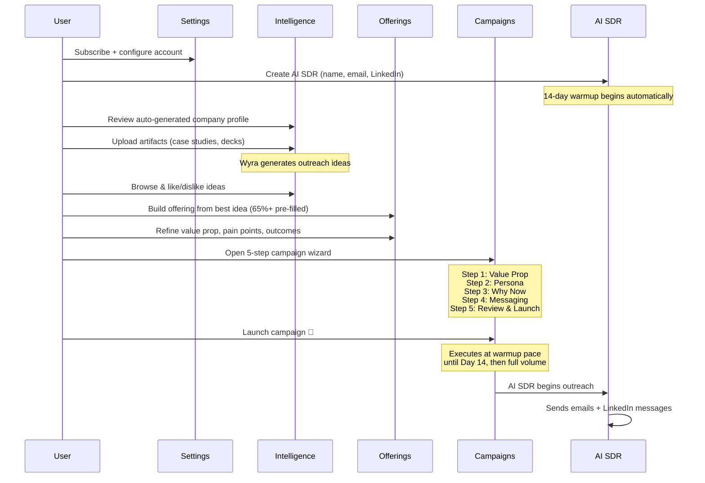
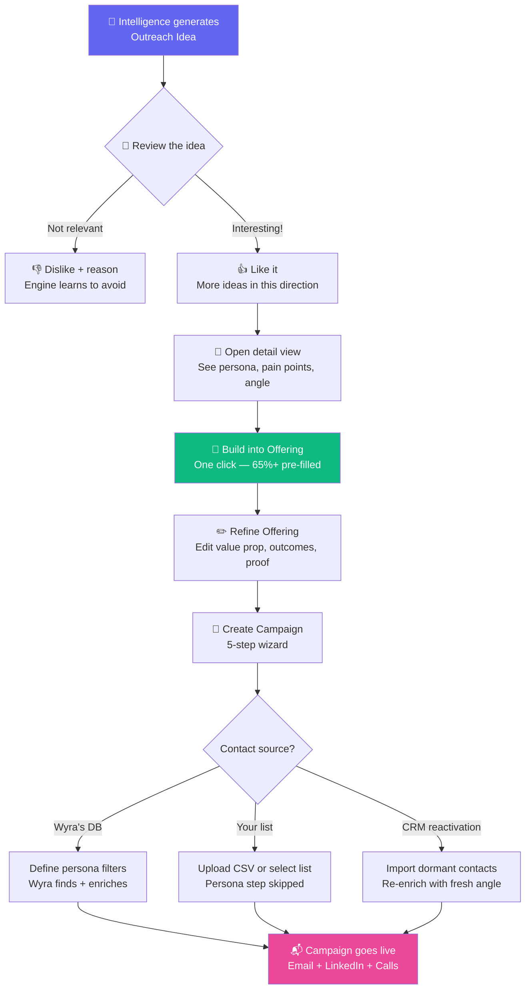
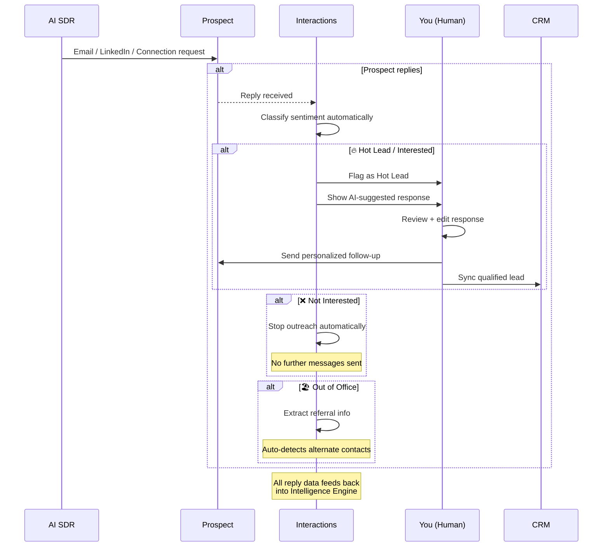
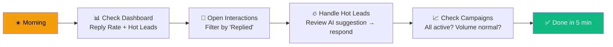
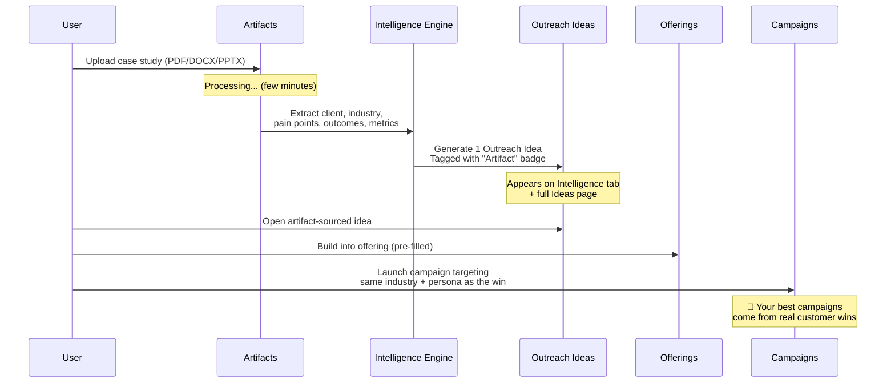
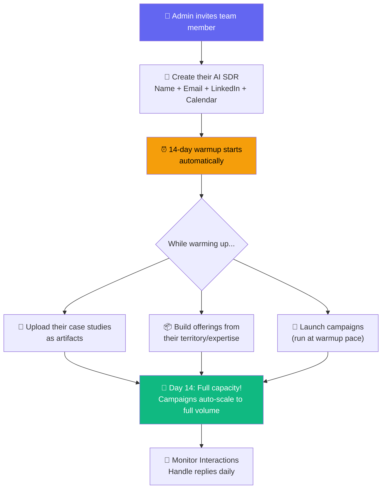
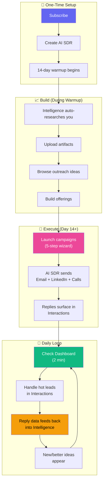

# 🔄 Wyra — End-to-End Flow Tracing

> The 5 most important user journeys traced step by step with diagrams.

---

## Flow 1: First-Time Setup → First Campaign (The "Day 1" Flow)

> **Goal:** Go from zero to a live campaign in 15 minutes.

### Pre-requisites Checklist
- [ ] Active Wyra subscription
- [ ] At least one AI SDR configured (name + email + LinkedIn)
- [ ] Understand that warmup = 14 days (but you can build & launch during it)

---

## Flow 2: Outreach Idea → Live Campaign (The Core Loop)

> **Goal:** Turn an AI-generated idea into a running campaign.

---

## Flow 3: Campaign Running → Handling Replies (The "Daily" Flow)

> **Goal:** Your 5-minute daily routine for managing replies and converting leads.

### Your Daily Routine

---

## Flow 4: Uploading an Artifact → New Campaign Angle

> **Goal:** Turn a new customer win into your next campaign.

> **The compounding effect:** Close a deal → upload case study → Wyra generates idea targeting same profile → launch campaign → close another deal → repeat.

---

## Flow 5: New Team Member Onboarding

> **Goal:** Add a new sales rep and get them running campaigns.

> **Pro tip:** Invite 3 team members at once — all 3 warm up in parallel and hit full capacity on the same day, tripling your outreach.

---

## 🗺️ The Complete User Journey Map

---

*This completes the Wyra onboarding documentation! 🎉*
